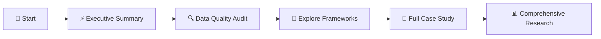

# 🎬 Netflix India PM Case Study - Educational Framework

> **⚠️ CRITICAL DISCLAIMER: FOR EDUCATIONAL PURPOSES ONLY**

This repository contains a **hypothetical product management case study** created as a learning exercise by Vikas Sahani. It is **NOT** based on insider information, proprietary data, or any affiliation with Netflix, Inc.

<div align="center">

### 📚 EDUCATIONAL CASE STUDY DISCLAIMER

</div>

<table>
<tr>
<td>

- 🎓 This is a simulated analysis for learning product management methodologies
- 📊 All data, insights, and recommendations are hypothetical and for educational purposes only
- 🔒 No confidential, proprietary, or insider information has been used
- 🚫 This case study does not represent actual Netflix strategy or business decisions
- 🌐 All market data is sourced from publicly available information only

</td>
</tr>
</table>

> **📌 Not affiliated with Netflix, Inc. All trademarks are property of their respective owners.**

---

## 📖 What This Is

<details open>
<summary><strong>Click to expand</strong></summary>

An educational demonstration of:

- 🔍 Product management research methodology
- ✅ Data quality audit processes
- 📈 Strategic framework application (RICE, JTBD, OKRs, North Star metrics)
- 🎯 How to distinguish verified facts from assumptions
- 📊 Quantifying confidence in product decisions
- 🧪 Building validation plans before execution

</details>

## ❌ What This Is NOT

<table>
<tr>
<td>

- ❌ Official Netflix strategy or internal data
- ❌ Investment advice or business intelligence
- ❌ Ready-to-execute recommendations
- ❌ Suitable for commercial decision-making without independent validation
- ❌ Claiming insider knowledge or proprietary information

</td>
</tr>
</table>

---

## 📁 Repository Structure

```
netflix-india-pm-case-study/
├── 📄 README.md (this file)
├── 📜 LICENSE
├── 📂 research/
│   ├── 📝 full-case-study.md (complete analysis with audit)
│   ├── ⚡ executive-summary.md (5-minute read)
│   ├── 🔍 data-quality-audit.md (lessons on research integrity)
│   └── 📊 netflix-india-comprehensive-research.md (comprehensive analysis)
├── 📂 frameworks/
│   ├── 🎯 rice-prioritization-template.md
│   ├── 📈 retention-cohort-analysis.md
│   ├── 💰 financial-model-template.xlsx
│   ├── 🧪 ab-testing-guide.md
│   ├── 🎯 okr-framework.md
│   └── 💡 jobs-to-be-done-template.md
├── 📂 data-sources/
│   ├── ✅ verified-sources.md (all citations)
│   └── 📋 assumption-log.md (what's estimated vs. verified)
└── 📂 assets/
    └── 📂 diagrams/
        └── 📄 README.md (diagram documentation)
```

---

## 🚀 Quick Start

### 🎓 For Students / Learning PM



1. **Step 1:** Read `research/executive-summary.md` first (10 min)
2. **Step 2:** Study `research/data-quality-audit.md` to learn research integrity
3. **Step 3:** Explore `frameworks/` for reusable PM templates
4. **Step 4:** Read `research/full-case-study.md` for complete analysis
5. **Step 5:** Review `research/netflix-india-comprehensive-research.md` for detailed insights

### 👨‍🏫 For Educators

<table>
<tr>
<td width="50%">

**📚 Teaching Materials**
- Use `frameworks/` as teaching materials
- Assign `research/data-quality-audit.md` to teach critical thinking

</td>
<td width="50%">

**🔧 Customization**
- Adapt templates for other case studies
- Fork and modify for your curriculum

</td>
</tr>
</table>

### 💼 For Practitioners

> **💡 Pro Tip:** Focus on methodology, not conclusions

- 🔍 Review methodology, not conclusions
- 🎯 Apply frameworks to your own context
- 💬 Use as interview preparation material
- 🧪 Adapt validation plans for your products

---

## 🎯 Key Learning Outcomes

After studying this repository, you should understand:

| # | Learning Outcome | Icon |
|---|------------------|------|
| 1 | **Data Integrity**: How to separate verified facts from assumptions | 🔒 |
| 2 | **Confidence Quantification**: Using 0.00-1.00 scales for claims | 📊 |
| 3 | **Research Audit**: How to identify and correct data quality issues | 🔍 |
| 4 | **Framework Application**: RICE, JTBD, OKRs, cohort analysis, etc. | 🎯 |
| 5 | **Validation Planning**: Building experiments before committing resources | 🧪 |
| 6 | **Professional Communication**: Presenting uncertainty without undermining strategy | 💬 |

---

## 📊 Confidence Assessment

> **Overall Document Confidence: 0.62/1.00**

<table>
<thead>
<tr>
<th>Component</th>
<th>Confidence</th>
<th>Status</th>
</tr>
</thead>
<tbody>
<tr>
<td>🎯 Strategic Frameworks</td>
<td><code>0.85</code></td>
<td>✅ Sound methodology</td>
</tr>
<tr>
<td>📈 Verified Market Facts</td>
<td><code>0.95</code></td>
<td>✅ Properly sourced</td>
</tr>
<tr>
<td>🔍 Competitive Analysis</td>
<td><code>0.60</code></td>
<td>⚠️ Analyst estimates</td>
</tr>
<tr>
<td>👥 User Behavior Patterns</td>
<td><code>0.45</code></td>
<td>⚠️ [ASSUMPTION] based</td>
</tr>
<tr>
<td>💰 Financial Projections</td>
<td><code>0.40</code></td>
<td>⚠️ [SCENARIO] modeling</td>
</tr>
</tbody>
</table>

<div align="center">

| ✅ Appropriate for | ❌ Not appropriate for |
|-------------------|----------------------|
| Learning, discussion, framework practice | Production deployment, investment decisions |

</div>

---

## 🛠️ How to Use This Repository

### 🎓 Academic Use

<table>
<tr>
<td>

✅ **Permitted Uses:**
- Case study for PM courses
- Framework learning exercises
- Critical thinking assignments
- Research methodology examples

</td>
<td>

📝 **Citation Format:**
> "Hypothetical educational case study"

</td>
</tr>
</table>

### 💼 Professional Development

<table>
<tr>
<td>

✅ **Permitted Uses:**
- Interview preparation
- PM skill development
- Portfolio demonstration (with context)
- Team training workshops

</td>
<td>

🏷️ **Framing:**
> "Learning project demonstrating PM methodology"

</td>
</tr>
</table>

### 🚫 Commercial Use

> **⚠️ WARNING: The following uses are NOT permitted**

<table>
<tr>
<td width="50%">

❌ **Prohibited:**
- Do NOT use for actual business decisions without validation
- Do NOT present as official analysis to stakeholders

</td>
<td width="50%">

❌ **Also Prohibited:**
- Do NOT claim affiliation with Netflix or competitors
- Do NOT use for investment/consulting purposes

</td>
</tr>
</table>

---

## 🤝 Contributing

<div align="center">

### 💡 This is a learning resource. Contributions welcome!

</div>

**We accept contributions for:**

- 🐛 Correcting factual errors in verified data
- 📈 Improving framework templates
- 📝 Adding educational annotations
- 🎯 Suggesting additional PM methodologies

> 📌 See the repository issues section for contribution guidelines.

---

## 📚 Data Sources

<table>
<tr>
<td>

**📋 All verified facts are cited in:**
`data-sources/verified-sources.md`

</td>
</tr>
</table>

**🔍 Key sources include:**

| Source Type | Examples |
|------------|----------|
| 📊 Financial Data | Netflix investor relations (earnings calls) |
| 🤝 Market Events | Public merger announcements |
| 📈 Industry Reports | FICCI-EY, Media Partners Asia |
| 🌐 Official Sources | Official company websites |

> **📋 All assumptions are documented in:** `data-sources/assumption-log.md`

---

## 📜 License

<div align="center">

### Creative Commons Attribution-NonCommercial-ShareAlike 4.0 International

**CC BY-NC-SA 4.0**

</div>

<table>
<tr>
<td width="50%">

**✅ You are free to:**
- 📤 **Share:** Copy and redistribute for educational purposes
- 🔧 **Adapt:** Remix and build upon the material

</td>
<td width="50%">

**📋 Under these terms:**
- 👤 **Attribution:** Credit original author
- 🚫 **NonCommercial:** Not for commercial use
- 🔄 **ShareAlike:** Distribute derivatives under same license

</td>
</tr>
</table>

> 📄 See `LICENSE` file for full terms.

---

## 📞 Contact

<table>
<tr>
<td>

**👤 Author:** Vikas Sahani  
**🎯 Purpose:** Educational demonstration of PM research methodology  
**💼 LinkedIn:** [www.linkedin.com/in/vikas-sahani-727420358](https://www.linkedin.com/in/vikas-sahani-727420358)  
**📧 Email:** vikassahani17@gmail.com

</td>
</tr>
</table>

<div align="center">

### ❓ Questions?

**Open an issue or reach out directly.**

</div>

---

## 🙏 Acknowledgments

This case study uses public information and standard PM frameworks from:

<table>
<thead>
<tr>
<th>Source</th>
<th>Contribution</th>
</tr>
</thead>
<tbody>
<tr>
<td>📖 Marty Cagan's "Inspired"</td>
<td>Product vision frameworks</td>
</tr>
<tr>
<td>📖 Melissa Perri's "Escaping the Build Trap"</td>
<td>Outcomes focus methodology</td>
</tr>
<tr>
<td>🎓 Reforge product frameworks</td>
<td>RICE, retention analysis</td>
</tr>
<tr>
<td>🎯 Industry standard methodologies</td>
<td>OKRs, JTBD, cohort analysis</td>
</tr>
</tbody>
</table>

> **📌 All frameworks are cited and attributed appropriately.**

---

## 📅 Version History

<table>
<thead>
<tr>
<th>Version</th>
<th>Status</th>
<th>Description</th>
</tr>
</thead>
<tbody>
<tr>
<td><strong>v2.0</strong></td>
<td>✅ Current</td>
<td>Audit-corrected version with explicit assumption tagging</td>
</tr>
<tr>
<td><strong>v1.0</strong></td>
<td>❌ Superseded</td>
<td>Original research (contained untagged assumptions)</td>
</tr>
</tbody>
</table>

---

<div align="center">

**📅 Last Updated:** October 2025  
**🏷️ Status:** Educational case study - Active learning resource

</div>

---

## ⚖️ Legal Notice

<details>
<summary><strong>📜 COMPREHENSIVE LEGAL DISCLAIMER (Click to expand)</strong></summary>

<br>

This repository is an independent educational project created by Vikas Sahani and is not endorsed by, affiliated with, or sponsored by Netflix, Inc., Amazon, Disney, Reliance Industries, or any other company mentioned herein.

### 🎓 EDUCATIONAL USE ONLY:

- This case study is created solely for educational and learning purposes
- It demonstrates product management research methodologies and frameworks
- All analysis, recommendations, and insights are hypothetical and simulated
- This content is not suitable for commercial decision-making or investment purposes

### 🔐 INTELLECTUAL PROPERTY:

- All company names, product names, and trademarks are property of their respective owners
- Content is used here for educational and analytical purposes only under fair use principles
- No trademark infringement is intended
- All sources are properly cited and attributed

### 📊 DATA AND INFORMATION:

- No confidential, proprietary, or insider information has been used in creating this content
- All data is sourced from publicly available information only
- Market estimates and projections are hypothetical and for demonstration purposes
- No claims are made about actual company performance or strategies

### ⚠️ LIABILITY DISCLAIMER:

- The author (Vikas Sahani) assumes no responsibility for any decisions made based on this educational content
- This case study should not be used as a basis for business decisions without independent verification
- Users are responsible for ensuring compliance with applicable laws and regulations
- The author disclaims all liability for any damages arising from use of this educational material

### ✅ COMPLIANCE STATEMENT:

- This educational case study complies with fair use principles for educational content
- All content is original analysis and commentary on publicly available information
- No reproduction of copyrighted material beyond fair use limits
- Proper attribution and citation provided for all sources

</details>

---

<div align="center">

**Made with 💡 for learning | 🎓 Educational Resource | 🌟 Open Source**

[](https://creativecommons.org/licenses/by-nc-sa/4.0/)

</div>