# 📊 Diagrams and Visual Assets

<div align="center">


</div>

---

## ⚠️ EDUCATIONAL PURPOSE ONLY - NOT AFFILIATED WITH NETFLIX

> **EDUCATIONAL CASE STUDY DISCLAIMER:**
> 
> | Field | Details |
> |-------|---------|
> | **Author** | Vikas Sahani (vikassahani17@gmail.com) |
> | **Purpose** | Educational demonstration of product management research methodologies |
> | **Nature** | Hypothetical analysis for learning purposes only |
> | **Data Sources** | Publicly available information only |
> | **Compliance** | No confidential, proprietary, or insider information used |
> | **Disclaimer** | This analysis does not represent actual Netflix strategy or business decisions |

---

## 📑 Table of Contents

- [Overview](#-overview)
- [Available Diagrams](#-available-diagrams)
- [Usage Guidelines](#-usage-guidelines)
- [Diagram Creation Standards](#-diagram-creation-standards)
- [File Formats](#-file-formats)
- [Maintenance and Updates](#-maintenance-and-updates)
- [Contributing](#-contributing)
- [Tools and Resources](#-tools-and-resources)
- [Legal and Ethical Considerations](#-legal-and-ethical-considerations)
- [Contact and Support](#-contact-and-support)

---

## 🎯 Overview

This directory contains visual assets and diagrams that support the Netflix India PM case study. These diagrams are created for educational purposes to illustrate product management concepts and frameworks.


---

## 📈 Available Diagrams

### 1️⃣ Market Analysis Diagrams

<table>
<thead>
<tr>
<th>Diagram</th>
<th>Description</th>
<th>Use Case</th>
</tr>
</thead>
<tbody>
<tr>
<td>🗺️ <strong>Competitive Landscape Map</strong></td>
<td>Visual representation of streaming market players and positioning</td>
<td>Strategic planning, competitor analysis</td>
</tr>
<tr>
<td>📊 <strong>Market Share Distribution</strong></td>
<td>Current competitive landscape analysis</td>
<td>Market sizing, opportunity identification</td>
</tr>
<tr>
<td>📈 <strong>Growth Trend Analysis</strong></td>
<td>Market evolution and opportunity identification</td>
<td>Forecasting, trend analysis</td>
</tr>
</tbody>
</table>

### 2️⃣ User Journey Diagrams

<table>
<thead>
<tr>
<th>Diagram</th>
<th>Description</th>
<th>Use Case</th>
</tr>
</thead>
<tbody>
<tr>
<td>🛤️ <strong>User Journey Map</strong></td>
<td>Complete user experience flow with pain points and opportunities</td>
<td>UX optimization, pain point identification</td>
</tr>
<tr>
<td>👤 <strong>User Persona Profiles</strong></td>
<td>Target user segments and their characteristics</td>
<td>Segmentation, personalization</td>
</tr>
<tr>
<td>🎯 <strong>Touchpoint Analysis</strong></td>
<td>Key interaction points in user journey</td>
<td>Channel optimization, CX improvement</td>
</tr>
</tbody>
</table>

### 3️⃣ Product Strategy Diagrams

<table>
<thead>
<tr>
<th>Diagram</th>
<th>Description</th>
<th>Use Case</th>
</tr>
</thead>
<tbody>
<tr>
<td>🎲 <strong>Feature Prioritization Matrix</strong></td>
<td>RICE scoring visualization with implementation roadmap</td>
<td>Roadmap planning, resource allocation</td>
</tr>
<tr>
<td>🗓️ <strong>Product Roadmap</strong></td>
<td>Timeline of planned features and strategic initiatives</td>
<td>Stakeholder communication, planning</td>
</tr>
<tr>
<td>💎 <strong>Value Proposition Canvas</strong></td>
<td>Visual representation of value propositions</td>
<td>Product-market fit, messaging</td>
</tr>
</tbody>
</table>

### 4️⃣ Financial Model Diagrams

<table>
<thead>
<tr>
<th>Diagram</th>
<th>Description</th>
<th>Use Case</th>
</tr>
</thead>
<tbody>
<tr>
<td>💰 <strong>Revenue Projection Model</strong></td>
<td>Financial forecasting with subscriber growth and ARPU evolution</td>
<td>Business planning, investor communication</td>
</tr>
<tr>
<td>💵 <strong>Cost Structure Analysis</strong></td>
<td>Breakdown of operational costs and profitability</td>
<td>Budget planning, efficiency optimization</td>
</tr>
<tr>
<td>📊 <strong>ROI Analysis</strong></td>
<td>Return on investment calculations and break-even analysis</td>
<td>Investment decisions, prioritization</td>
</tr>
</tbody>
</table>

### 5️⃣ Framework Diagrams

<table>
<thead>
<tr>
<th>Diagram</th>
<th>Description</th>
<th>Use Case</th>
</tr>
</thead>
<tbody>
<tr>
<td>🎯 <strong>OKR Framework Structure</strong></td>
<td>Visual representation of objectives and key results with progress tracking</td>
<td>Goal setting, performance tracking</td>
</tr>
<tr>
<td>🔧 <strong>Jobs-to-be-Done Framework</strong></td>
<td>Customer job mapping with pain points and gain creators</td>
<td>Innovation, product development</td>
</tr>
<tr>
<td>🧪 <strong>A/B Testing Flow</strong></td>
<td>Experimental design visualization and methodology</td>
<td>Experimentation, data-driven decisions</td>
</tr>
</tbody>
</table>

---

## 📋 Usage Guidelines

### 1. ✅ Educational Use

<details>
<summary><strong>Permitted Educational Uses</strong></summary>

- ✅ Use for learning and understanding PM concepts
- ✅ Reference in academic presentations and papers
- ✅ Include in portfolio demonstrations (with proper attribution)
- ✅ Adapt for other case studies and projects

</details>

### 2. 💼 Professional Development

<details>
<summary><strong>Permitted Professional Uses</strong></summary>

- ✅ Use for interview preparation and skill development
- ✅ Reference in team training and workshops
- ✅ Adapt frameworks for your own products
- ✅ Use as templates for similar analyses

</details>

### 3. ❌ Commercial Use Restrictions

> **⚠️ IMPORTANT: The following uses are NOT permitted:**

<table>
<thead>
<tr>
<th>Restriction</th>
<th>Reason</th>
</tr>
</thead>
<tbody>
<tr>
<td>❌ Do NOT use for actual business decisions without validation</td>
<td>Hypothetical data may not reflect reality</td>
</tr>
<tr>
<td>❌ Do NOT present as official Netflix analysis</td>
<td>No affiliation with Netflix, Inc.</td>
</tr>
<tr>
<td>❌ Do NOT claim affiliation with Netflix or competitors</td>
<td>Independent educational work</td>
</tr>
<tr>
<td>❌ Do NOT use for investment or consulting purposes</td>
<td>Not validated for commercial decisions</td>
</tr>
</tbody>
</table>

---

## 🎨 Diagram Creation Standards

### 1. Design Principles


### 2. Data Representation

| Principle | Implementation | Validation |
|-----------|----------------|------------|
| **Verified Data** | Clearly marked with confidence levels | ✓ Source citation required |
| **Assumptions** | Explicitly labeled as estimates or scenarios | ✓ Transparency mandatory |
| **Sources** | Proper attribution and citation | ✓ Reference list included |
| **Limitations** | Clear indication of data constraints | ✓ Scope documented |

### 3. Visual Standards

<details>
<summary><strong>Color Scheme Guidelines</strong></summary>

- **Primary Colors**: Professional, accessible color palette
- **Contrast Ratio**: Minimum 4.5:1 for text
- **Colorblind Safe**: Use patterns and labels in addition to colors
- **Brand Neutral**: Avoid brand-specific colors for competitive analysis

</details>

<details>
<summary><strong>Typography Guidelines</strong></summary>

- **Headings**: Clear, readable fonts (minimum 16pt)
- **Body Text**: Minimum 12pt for readability
- **Annotations**: Minimum 10pt with high contrast
- **Font Families**: Sans-serif for digital, serif for print

</details>

<details>
<summary><strong>Layout Guidelines</strong></summary>

- **Flow**: Logical left-to-right, top-to-bottom organization
- **Whitespace**: Adequate spacing for visual clarity
- **Hierarchy**: Clear visual hierarchy with size and weight
- **Alignment**: Consistent alignment and grid usage

</details>

<details>
<summary><strong>Annotation Guidelines</strong></summary>

- **Labels**: Helpful, concise labels and explanations
- **Callouts**: Strategic use of callouts for key insights
- **Legends**: Clear legends for complex visualizations
- **Notes**: Footnotes for additional context

</details>

---

## 📁 File Formats

### 1. Supported Formats

| Format | Use Case | Advantages | Best For |
|--------|----------|------------|----------|
| **PNG** | High-quality images for presentations | Universal compatibility, lossless | Slides, reports |
| **SVG** | Scalable vector graphics for web use | Infinite scaling, small file size | Web, responsive design |
| **PDF** | Print-ready documents | Professional output, embedded fonts | Publications, handouts |
| **Mermaid** | Text-based diagram source files | Version control, easy editing | Documentation, GitHub |

### 2. File Naming Convention

```
[category]-[diagram-name]-[version]-[date].[format]

Examples:
- market-analysis-competitive-landscape-v2-20251005.png
- user-journey-map-v1-20251005.svg
- financial-revenue-projection-v3-20251005.pdf
- product-feature-matrix-v1-20251005.mmd
```

**Convention Rules:**
- **Descriptive Names**: Clear, descriptive file names (lowercase, hyphen-separated)
- **Version Control**: Include version numbers for updates (v1, v2, v3)
- **Date Stamps**: Include creation or update dates (YYYYMMDD format)
- **Format Indicators**: Clear file extension indicators

---

## 🔄 Maintenance and Updates

### 1. Regular Updates


| Update Type | Frequency | Responsibility | Review Required |
|-------------|-----------|----------------|-----------------|
| **Data Updates** | Monthly | Content Owner | Yes |
| **Style Updates** | Quarterly | Design Lead | Yes |
| **Content Updates** | As needed | Domain Expert | Yes |
| **Quality Checks** | Monthly | QA Team | Yes |

### 2. Version Control

<details>
<summary><strong>Change Tracking Process</strong></summary>

1. **Document Changes**: Record all diagram modifications in changelog
2. **Backup Copies**: Maintain previous versions in archive folder
3. **Update Logs**: Record update history with rationale
4. **Quality Assurance**: Review before publication with checklist

</details>

**Version History Template:**

```markdown
## [Version X.Y] - YYYY-MM-DD
### Added
- New diagram: [Name]
- New feature: [Description]

### Changed
- Updated data in: [Diagram Name]
- Revised layout: [Description]

### Fixed
- Corrected error in: [Diagram Name]
- Improved accessibility: [Description]
```

---

## 🤝 Contributing

### 1. New Diagrams


**Process Steps:**

1. **Proposal**: Suggest new diagram ideas via Issues
2. **Design**: Create diagrams following standards
3. **Review**: Submit for quality review via Pull Request
4. **Documentation**: Provide usage guidelines and metadata

### 2. Improvements

| Contribution Type | How to Submit | Review Time |
|-------------------|---------------|-------------|
| **Feedback** | GitHub Issues | 3-5 days |
| **Corrections** | Pull Request | 1-2 days |
| **Enhancements** | Pull Request | 5-7 days |
| **Updates** | Pull Request | 2-3 days |

---

## 🛠️ Tools and Resources

### 1. Diagram Creation Tools

| Tool | Type | Cost | Best For |
|------|------|------|----------|
| **[Mermaid](https://mermaid.js.org/)** | Text-based | Free | Version-controlled diagrams |
| **[Draw.io](https://app.diagrams.net/)** | Visual editor | Free | Complex flowcharts |
| **[Figma](https://www.figma.com/)** | Design platform | Free/Paid | Professional designs |
| **[PowerPoint](https://www.microsoft.com/microsoft-365/powerpoint)** | Presentation | Paid | Presentations |

### 2. Data Visualization Tools

| Tool | Type | Cost | Best For |
|------|------|------|----------|
| **[Tableau](https://www.tableau.com/)** | BI Platform | Paid | Advanced analytics |
| **[Excel](https://www.microsoft.com/microsoft-365/excel)** | Spreadsheet | Paid | Basic charts |
| **[Google Charts](https://developers.google.com/chart)** | Web library | Free | Interactive web charts |
| **[D3.js](https://d3js.org/)** | JS library | Free | Custom visualizations |

### 3. Design Resources

<details>
<summary><strong>Recommended Resources</strong></summary>

**Color Palettes:**
- [Coolors](https://coolors.co/) - Color scheme generator
- [Adobe Color](https://color.adobe.com/) - Accessible color wheels
- [ColorBrewer](https://colorbrewer2.org/) - Colorblind-safe palettes

**Icon Libraries:**
- [Font Awesome](https://fontawesome.com/) - Icon library
- [Lucide](https://lucide.dev/) - Open-source icons
- [Heroicons](https://heroicons.com/) - Tailwind CSS icons

**Font Resources:**
- [Google Fonts](https://fonts.google.com/) - Free web fonts
- [Font Squirrel](https://www.fontsquirrel.com/) - Commercial fonts
- [Adobe Fonts](https://fonts.adobe.com/) - Professional typography

**Templates:**
- [Canva](https://www.canva.com/) - Design templates
- [Notion](https://www.notion.so/templates) - Document templates
- [Miro](https://miro.com/templates/) - Collaboration templates

</details>

---

## ⚖️ Legal and Ethical Considerations

### 1. Copyright and Attribution

```mermaid
graph LR
    A[Content Usage] --> B{Original?}
    B -->|Yes| C[✅ Use Freely]
    B -->|No| D{Attributed?}
    D -->|Yes| E{Fair Use?}
    D -->|No| F[❌ Do Not Use]
    E -->|Yes| G[✅ Use with Citation]
    E -->|No| H[❌ Do Not Use]
    
    style C fill:#4CAF50
    style F fill:#F44336
    style G fill:#8BC34A
    style H fill:#F44336
```



| Principle | Implementation | Verification |
|-----------|----------------|--------------|
| **Original Content** | All diagrams are original creations | ✓ Author declaration |
| **Source Attribution** | Proper citation of data sources | ✓ Reference list |
| **Fair Use** | Educational use under fair use principles | ✓ Purpose statement |
| **No Infringement** | No unauthorized use of copyrighted material | ✓ Legal review |

### 2. Ethical Guidelines

> **Our Commitment to Ethical Practice**

<table>
<thead>
<tr>
<th>Principle</th>
<th>Practice</th>
<th>Verification</th>
</tr>
</thead>
<tbody>
<tr>
<td>🔍 <strong>Transparency</strong></td>
<td>Clear indication of assumptions and limitations</td>
<td>Explicit disclaimers on all artifacts</td>
</tr>
<tr>
<td>✅ <strong>Accuracy</strong></td>
<td>Best effort to ensure data accuracy</td>
<td>Multi-source verification</td>
</tr>
<tr>
<td>📝 <strong>Context</strong></td>
<td>Appropriate context and disclaimers</td>
<td>Educational purpose labels</td>
</tr>
<tr>
<td>🛡️ <strong>Responsibility</strong></td>
<td>Ethical use of information</td>
<td>Usage guidelines enforcement</td>
</tr>
</tbody>
</table>

---

## 📞 Contact and Support

### 1. Questions and Feedback

<table>
<thead>
<tr>
<th>Type</th>
<th>Channel</th>
<th>Response Time</th>
</tr>
</thead>
<tbody>
<tr>
<td>🐛 <strong>Issues</strong></td>
<td>GitHub Issues</td>
<td>1-3 business days</td>
</tr>
<tr>
<td>💡 <strong>Suggestions</strong></td>
<td>GitHub Discussions</td>
<td>3-5 business days</td>
</tr>
<tr>
<td>❓ <strong>Questions</strong></td>
<td>Email / LinkedIn</td>
<td>2-4 business days</td>
</tr>
<tr>
<td>🤝 <strong>Collaboration</strong></td>
<td>Pull Requests</td>
<td>5-7 business days</td>
</tr>
</tbody>
</table>

### 2. Resources and Help

| Resource Type | Access | Description |
|---------------|--------|-------------|
| 📚 **Documentation** | [Wiki](#) | Comprehensive usage guidelines |
| 💼 **Examples** | [Examples Folder](#) | Sample implementations and use cases |
| 📋 **Templates** | [Templates Folder](#) | Reusable diagram templates |
| 🎓 **Training** | [Learning Path](#) | Educational materials and tutorials |

---

## 📜 Legal and Compliance Notice

<div align="center">

### **COMPREHENSIVE DISCLAIMER**

</div>

> This directory is an educational case study created by **Vikas Sahani** for learning product management methodologies. It is **not affiliated with, endorsed by, or sponsored by Netflix, Inc.** or any other company mentioned herein.

<details open>
<summary><strong>📚 EDUCATIONAL USE ONLY</strong></summary>

- ✏️ This directory is created solely for educational and learning purposes
- 🎭 All data, insights, and recommendations are hypothetical and simulated
- 🔒 No confidential, proprietary, or insider information has been used
- ⚠️ This content is not suitable for commercial decision-making or investment purposes

</details>

<details open>
<summary><strong>📊 DATA SOURCES AND CITATIONS</strong></summary>

- 🌐 All data is sourced from publicly available information only
- 📈 Market estimates and projections are hypothetical and for demonstration purposes
- 📝 All sources are properly cited and attributed throughout the document
- 🚫 No claims are made about actual company performance or strategies

</details>

---

<div align="center">

## 👤 Author Information

**Vikas Sahani**

[](mailto:vikassahani17@gmail.com)
[](https://www.linkedin.com/in/vikas-sahani-727420358)

**Purpose:** Educational demonstration of PM research methodology

---

### 📄 Document Status

| Attribute | Value |
|-----------|-------|
| **Version** | 1.1 |
| **Last Updated** | October 5, 2025 |
| **Status** | Active |
| **Review Cycle** | Quarterly |
| **Next Review** | January 2026 |

---

**Made with ❤️ for the Product Management Community**

[⬆ Back to Top](#-diagrams-and-visual-assets)

</div>