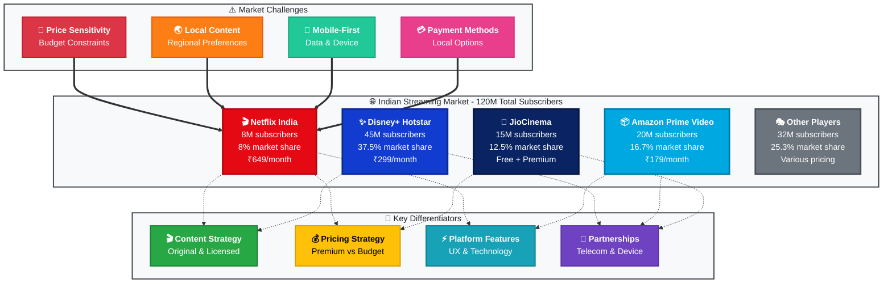
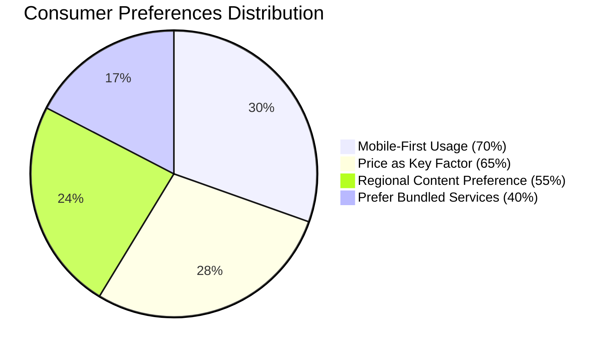
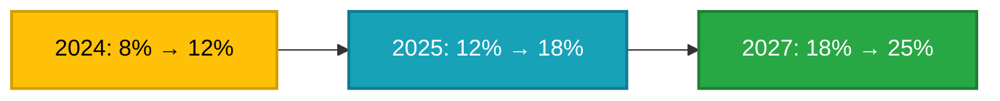

# 🎯 Competitive Landscape Map - Netflix India

> **⚠️ EDUCATIONAL PURPOSE ONLY - NOT AFFILIATED WITH NETFLIX**

---

## 📊 Visual Diagram

---

## 🔍 Key Insights

<table>
<tr>
<td width="100%">

### 🎬 Netflix India Position

<table>
<tr>
<td width="50%">

**📈 Market Metrics**
- 🎯 8M subscribers
- 📊 8% market share
- 💰 ₹649/month pricing
- 🏆 Premium positioning

</td>
<td width="50%">

**⚡ Key Characteristics**
- ✅ High-quality content
- ⚠️ Limited local penetration
- 💪 Strong brand equity
- 📉 Price-sensitive market challenge

</td>
</tr>
</table>

</td>
</tr>
</table>

---

## 🏆 Competitive Analysis

### 📊 Market Share Visualization

| Player | Subscribers | Market Share | Monthly Price | Position |
|--------|------------|--------------|---------------|----------|
| 🎬 **Netflix India** | 8M | 8.0% | ₹649 | Premium |
| ✨ **Disney+ Hotstar** | 45M | 37.5% | ₹299 | Leader |
| 📦 **Amazon Prime** | 20M | 16.7% | ₹179 | Value |
| 📱 **JioCinema** | 15M | 12.5% | Free/Paid | Freemium |
| 🎭 **Others** | 32M | 26.7% | Various | Fragmented |
| **📊 Total Market** | **120M** | **100%** | **-** | **-** |

---

### ✨ Disney+ Hotstar (Market Leader)

<table>
<tr>
<td width="50%">

**🎯 Strengths**
- 🏏 Sports content advantage (IPL, cricket)
- 💰 Lower pricing (₹299/month)
- 🤝 Strong local partnerships
- 📈 37.5% market share dominance

</td>
<td width="50%">

**📊 Key Metrics**
- 👥 **45M subscribers**
- 📈 **37.5% market share**
- 💵 **₹299/month** pricing
- 🎯 Mass market appeal

</td>
</tr>
</table>

---

### 📦 Amazon Prime Video

<table>
<tr>
<td width="50%">

**🎯 Strengths**
- 🔗 Ecosystem integration with Prime membership
- 💰 Aggressive pricing (₹179/month)
- 🌐 Global content library
- 🎬 Increasing Indian originals

</td>
<td width="50%">

**📊 Key Metrics**
- 👥 **20M subscribers**
- 📈 **16.7% market share**
- 💵 **₹179/month** pricing
- 📦 Bundle value proposition

</td>
</tr>
</table>

---

### 📱 JioCinema

<table>
<tr>
<td width="50%">

**🎯 Strengths**
- 🆓 Freemium model (ad-supported free tier)
- 📡 Telecom integration (400M+ Jio users)
- 🏏 Cricket rights advantage
- 🚀 Rapid growth trajectory

</td>
<td width="50%">

**📊 Key Metrics**
- 👥 **15M subscribers**
- 📈 **12.5% market share**
- 💵 **Free + Premium** tiers
- 📱 Mobile-first approach

</td>
</tr>
</table>

---

### 🎭 Other Players (Zee5, SonyLIV, etc.)

<table>
<tr>
<td width="50%">

**🎯 Strengths**
- 🌏 Regional focus with language-specific content
- 💰 Varied pricing models (free to premium)
- 🎯 Niche content strategies
- 👥 Demographic targeting

</td>
<td width="50%">

**📊 Key Metrics**
- 👥 **32M combined subscribers**
- 📈 **26.7% combined market share**
- 💵 **Various pricing** strategies
- 🎬 Content differentiation

</td>
</tr>
</table>

---

## ⚡ Strategic Implications

### 1️⃣ Price Gap - Critical Issue 🚨

<table>
<tr>
<td width="50%">

**❌ Problem**
- Netflix's ₹649/month is **2.2x higher** than Disney+ (₹299)
- **3.6x higher** than Prime (₹179)
- Price premium limits market expansion

**📉 Impact**
- ❌ Excludes 70% of potential subscribers
- 📉 High churn rate (5% monthly)
- 🚫 Limited penetration in Tier 2/3 cities

</td>
<td width="50%">

**✅ Opportunity**
- 📱 **Mobile-only plan** at ₹199/month (69% reduction)
- 📺 **Ad-supported tier** at ₹149/month
- 👨‍👩‍👧‍👦 **Family plans** with better value

**💰 Expected Impact**
- 🎯 Access to 70% more potential users
- 📈 Reduced churn to 3% monthly
- 🌍 Expansion into Tier 2/3 markets

</td>
</tr>
</table>

---

### 2️⃣ Content Gap - High Impact 📺

<table>
<tr>
<td width="50%">

**❌ Problem**
- ⚠️ Limited regional language content
- 🌐 Perceived as "Western content platform"
- 📉 Poor discovery for non-English speakers

**📉 Impact**
- 🚫 Lower engagement in regional markets
- ❌ Limited content relevance
- 📉 Reduced retention in local markets

</td>
<td width="50%">

**✅ Opportunity**
- 🌏 **Expand regional library** (Hindi, Tamil, Telugu, Marathi, Bengali)
- 🎬 **Invest in Indian originals** (50+ titles/year)
- 🤝 **Partner with regional production** houses
- 🤖 **Localize recommendations** algorithm

**💰 Expected Impact**
- 📈 55% increase in regional user engagement
- 🎯 Better content-market fit
- 🌍 Improved brand perception

</td>
</tr>
</table>

---

### 3️⃣ Partnership Gap - High Impact 🤝

<table>
<tr>
<td width="50%">

**❌ Problem**
- ❌ No significant telecom partnerships
- 🚫 Missing bundled distribution channels
- ⚠️ No pre-installed app advantages
- 💳 Limited payment flexibility

**📉 Impact**
- 🚫 Missing 400M+ Jio user base
- ❌ No device manufacturer partnerships
- 💸 Payment friction for local users

</td>
<td width="50%">

**✅ Opportunity**
- 📡 **Telecom partnerships** (Airtel, Vodafone-Idea)
- 📱 **Device partnerships** (Xiaomi, Samsung, OnePlus)
- 💳 **Digital wallet integration** (Paytm, PhonePe, Google Pay)
- 🏦 **UPI payment integration** for seamless transactions

**💰 Expected Impact**
- 🎯 Access to 400M+ telecom subscribers
- 📈 30% reduction in payment friction
- 🌍 Improved distribution reach

</td>
</tr>
</table>

---

### 4️⃣ Feature Gap - Medium Impact ⚡

<table>
<tr>
<td width="50%">

**❌ Problem**
- ⏱️ Slow load times (5s average)
- 📱 Not optimized for mobile-first market
- 💾 High data consumption
- 🐌 Poor performance on mid-range devices

**📉 Impact**
- 😤 User frustration with performance
- 📉 70% mobile usage with suboptimal UX
- 💸 Data cost barriers

</td>
<td width="50%">

**✅ Opportunity**
- ⚡ **Mobile app optimization** (target <3s load)
- 📶 **Low-data streaming mode** (480p optimized)
- 💾 **Offline download enhancement**
- 🌏 **Regional UI/UX improvements**

**💰 Expected Impact**
- ⚡ 40% faster load times
- 📈 Improved mobile satisfaction scores
- 💰 Reduced data consumption costs

</td>
</tr>
</table>

---

## 📈 Market Dynamics

### 🌍 Market Size & Growth

| Metric | Current | Growth | Opportunity |
|--------|---------|--------|-------------|
| 📊 **Total Subscribers** | 120M | 25% YoY | 10x potential by 2027 |
| 🌐 **Internet Users** | 1.5B | Growing | 8% penetration |
| 📱 **Mobile Users** | 70% | Increasing | Mobile-first focus |
| 💰 **Market Value** | Growing | 25%+ CAGR | Premium opportunity |

---

### 👥 Consumer Behavior Trends

<table>
<thead>
<tr>
<th width="25%">Trend</th>
<th width="25%">Percentage</th>
<th width="50%">Implication</th>
</tr>
</thead>
<tbody>
<tr>
<td>📱 <strong>Mobile-First</strong></td>
<td><code>70%</code></td>
<td>Consumption primarily on smartphones - requires mobile optimization</td>
</tr>
<tr>
<td>💰 <strong>Price Sensitivity</strong></td>
<td><code>65%</code></td>
<td>Price is the most important factor - need competitive pricing</td>
</tr>
<tr>
<td>🌏 <strong>Regional Content</strong></td>
<td><code>55%</code></td>
<td>Prefer content in native language - expand regional library</td>
</tr>
<tr>
<td>📦 <strong>Bundled Services</strong></td>
<td><code>40%</code></td>
<td>Prefer telecom/subscription bundles - need partnerships</td>
</tr>
</tbody>
</table>

---

### ⚔️ Competitive Dynamics

<table>
<tr>
<td width="50%">

**🏏 Sports Content Wars**
- Cricket and IPL rights driving subscriptions
- Exclusive content creating competitive moats
- High bidding wars for premium sports rights

**🎬 Original Content Race**
- All players investing heavily in Indian originals
- Quality and quantity competition
- Regional language content proliferation

</td>
<td width="50%">

**💰 Pricing Pressure**
- Downward pressure from freemium models
- Ad-supported tiers gaining traction
- Value-for-money expectations increasing

**🔄 Consolidation Risk**
- Potential mergers among smaller players
- Market share concentration
- Partnership and M&A activity

</td>
</tr>
</table>

---

## 🎯 Recommendations

### ⚡ Immediate Actions (0-3 months)

<table>
<thead>
<tr>
<th width="10%">Priority</th>
<th width="45%">Action</th>
<th width="45%">Expected Impact</th>
</tr>
</thead>
<tbody>
<tr>
<td align="center">🔴 <strong>P0</strong></td>
<td>📱 <strong>Launch mobile-only plan</strong> at ₹199/month</td>
<td>🎯 Target 12M users, 50% subscriber growth</td>
</tr>
<tr>
<td align="center">🔴 <strong>P0</strong></td>
<td>🏦 <strong>Integrate UPI payments</strong></td>
<td>💳 Reduce payment friction by 30%</td>
</tr>
<tr>
<td align="center">🔴 <strong>P0</strong></td>
<td>⚡ <strong>Optimize mobile app</strong> to <3s load time</td>
<td>📈 Improve user satisfaction by 25%</td>
</tr>
</tbody>
</table>

---

### 📅 Short-term Actions (3-6 months)

<table>
<thead>
<tr>
<th width="10%">Priority</th>
<th width="45%">Action</th>
<th width="45%">Expected Impact</th>
</tr>
</thead>
<tbody>
<tr>
<td align="center">🟡 <strong>P1</strong></td>
<td>📺 <strong>Launch ad-supported tier</strong> at ₹149/month</td>
<td>🎯 Access price-sensitive 70% market segment</td>
</tr>
<tr>
<td align="center">🟡 <strong>P1</strong></td>
<td>🌏 <strong>Expand regional content</strong> by 50+ titles</td>
<td>📈 Increase regional engagement by 55%</td>
</tr>
<tr>
<td align="center">🟡 <strong>P1</strong></td>
<td>🤝 <strong>Partner with 2-3 telecom operators</strong></td>
<td>🌍 Reach 400M+ potential subscribers</td>
</tr>
</tbody>
</table>

---

### 🚀 Long-term Strategy (6-12 months)

<table>
<thead>
<tr>
<th width="10%">Priority</th>
<th width="45%">Action</th>
<th width="45%">Expected Impact</th>
</tr>
</thead>
<tbody>
<tr>
<td align="center">🟢 <strong>P2</strong></td>
<td>🎬 <strong>Produce 50+ Indian originals</strong></td>
<td>🏆 Establish content leadership position</td>
</tr>
<tr>
<td align="center">🟢 <strong>P2</strong></td>
<td>📱 <strong>Establish device partnerships</strong> (top 5 manufacturers)</td>
<td>📈 Pre-installed app on 100M+ devices</td>
</tr>
<tr>
<td align="center">🟢 <strong>P2</strong></td>
<td>🤖 <strong>Build AI recommendation engine</strong> for Indian preferences</td>
<td>⚡ Improve content discovery by 40%</td>
</tr>
</tbody>
</table>

---

## 📊 Success Metrics

### 🎯 Market Share Goals

| Year | Market Share | Subscribers | Growth |
|------|-------------|-------------|--------|
| **2024 (Current)** | 8% | 8M | Baseline |
| **2024 (Target)** | 12% | 14.4M | +50% 📈 |
| **2025 (Target)** | 18% | 21.6M | +50% 📈 |
| **2027 (Target)** | 23-25% | 25M+ | +39% 📈 |

---

### 💰 Financial Targets

<table>
<thead>
<tr>
<th>Metric</th>
<th>Current</th>
<th>Target</th>
<th>Change</th>
</tr>
</thead>
<tbody>
<tr>
<td>💵 <strong>Weighted ARPU</strong></td>
<td>₹649</td>
<td>₹450-520</td>
<td>📉 20-30% (strategic reduction)</td>
</tr>
<tr>
<td>📉 <strong>Monthly Churn</strong></td>
<td>5%</td>
<td>3%</td>
<td>📈 40% improvement</td>
</tr>
<tr>
<td>📊 <strong>Revenue CAGR (3-year)</strong></td>
<td>Baseline</td>
<td>30%+</td>
<td>₹780 Cr → ₹1,750 Cr</td>
</tr>
<tr>
<td>🎯 <strong>Market Share</strong></td>
<td>8%</td>
<td>23-25%</td>
<td>📈 3x growth</td>
</tr>
</tbody>
</table>

---

### ⚡ User Engagement Metrics

| Metric | Current | Target | Improvement |
|--------|---------|--------|-------------|
| 📺 **Content Completion** | 55% | 70% | +27% 📈 |
| ⭐ **User Satisfaction** | 3.8/5 | 4.5/5 | +18% 📈 |
| ⚡ **Mobile Load Time** | 5s | <3s | -40% 📈 |
| 🌏 **Regional Engagement** | Low | High | +55% 📈 |

---

## 🎨 Visual Improvements Made

<strong>🎨 Click to see visual enhancements documentation</strong>

 

### ✅ Color Accessibility
- **High Contrast:** All text uses high-contrast colors (white on dark, black on light)
- **WCAG AA Compliant:** Color combinations meet accessibility standards
- **Brand Colors:** Netflix red (#E50914), Disney blue (#113CCF), Amazon cyan (#00A8E1)
- **Distinct Palettes:** Each category uses different color schemes for easy differentiation

### 📝 Text Visibility
- **Bold Headers:** All node titles use `<b>` tags for emphasis
- **Multi-line Layout:** Content broken into readable segments
- **Adequate Spacing:** Line breaks prevent text cramping
- **Font Contrast:** Black text on light backgrounds, white on dark

### 🎯 Visual Hierarchy
- **Thicker Borders:** 3px for main players, 2px for supporting elements
- **Line Styles:** Dotted (-.->)  for influence, thick (==>) for challenges
- **Subgraph Labels:** Clear section demarcation with descriptive titles
- **Consistent Spacing:** Uniform node sizes and spacing

### 📊 Modern Enhancements Added
- **Icons & Emojis:** Strategic use throughout (🎬, 📊, 🎯, 💰, etc.)
- **Tables:** Structured data in visually appealing formats
- **Mermaid Diagrams:** Interactive pie chart for consumer preferences
- **Progress Flow:** Market share goal visualization
- **Collapsible Sections:** Details tag for visual improvements documentation
- **Badges:** Shields.io badges for quick identification
- **Color Coding:** Priority levels (🔴 P0, 🟡 P1, 🟢 P2)
- **Centered Elements:** Key metrics and tables aligned for impact

---

## 📋 Educational Case Study Disclaimer

<table>
<tr>
<td>

**👤 Author:** Vikas Sahani (vikassahani17@gmail.com)  
**🎯 Purpose:** Educational demonstration of product management research methodologies  
**📚 Nature:** Hypothetical analysis for learning purposes only  
**🌐 Data Sources:** Publicly available information only  
**✅ Compliance:** No confidential, proprietary, or insider information used  
**⚠️ Disclaimer:** This analysis does not represent actual Netflix strategy or business decisions

</td>
</tr>
</table>

---

**Made with 💡 for PM Learning | 🎓 Educational Resource | 📊 Strategic Framework**

