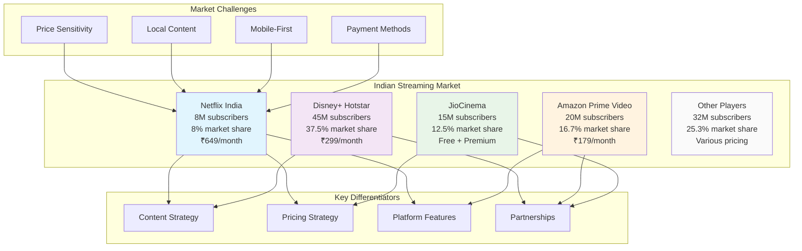

# Competitive Landscape Map - Netflix India

## Key Insights

- **Netflix**: Premium positioning with high-quality content but price-sensitive market
- **Disney+ Hotstar**: Market leader with sports content and local partnerships
- **Amazon Prime**: Ecosystem integration and global content library
- **JioCinema**: Aggressive pricing strategy with telecom integration

## Strategic Implications

1. **Price Gap**: Netflix's premium pricing creates opportunity for lower-tier plans
2. **Content Gap**: Need for more regional language and local content
3. **Partnership Gap**: Limited telecom and device partnerships
4. **Feature Gap**: Mobile-first optimization needed
