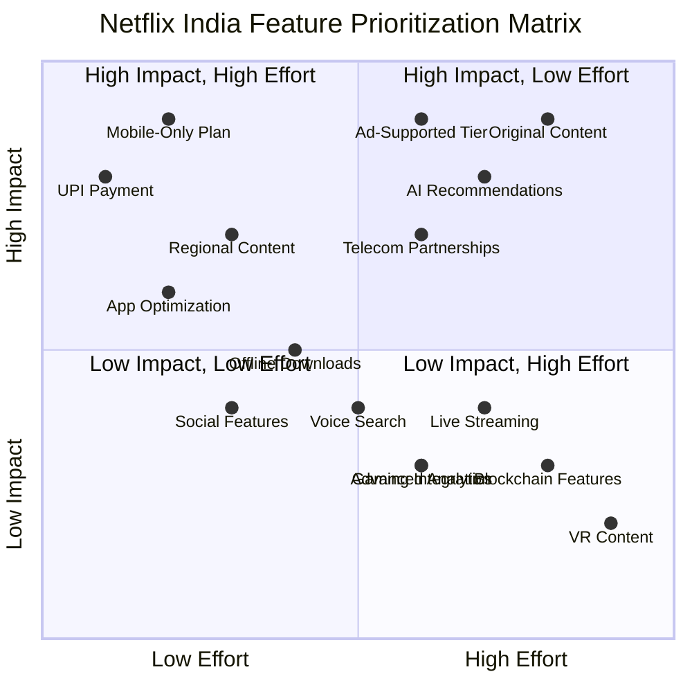
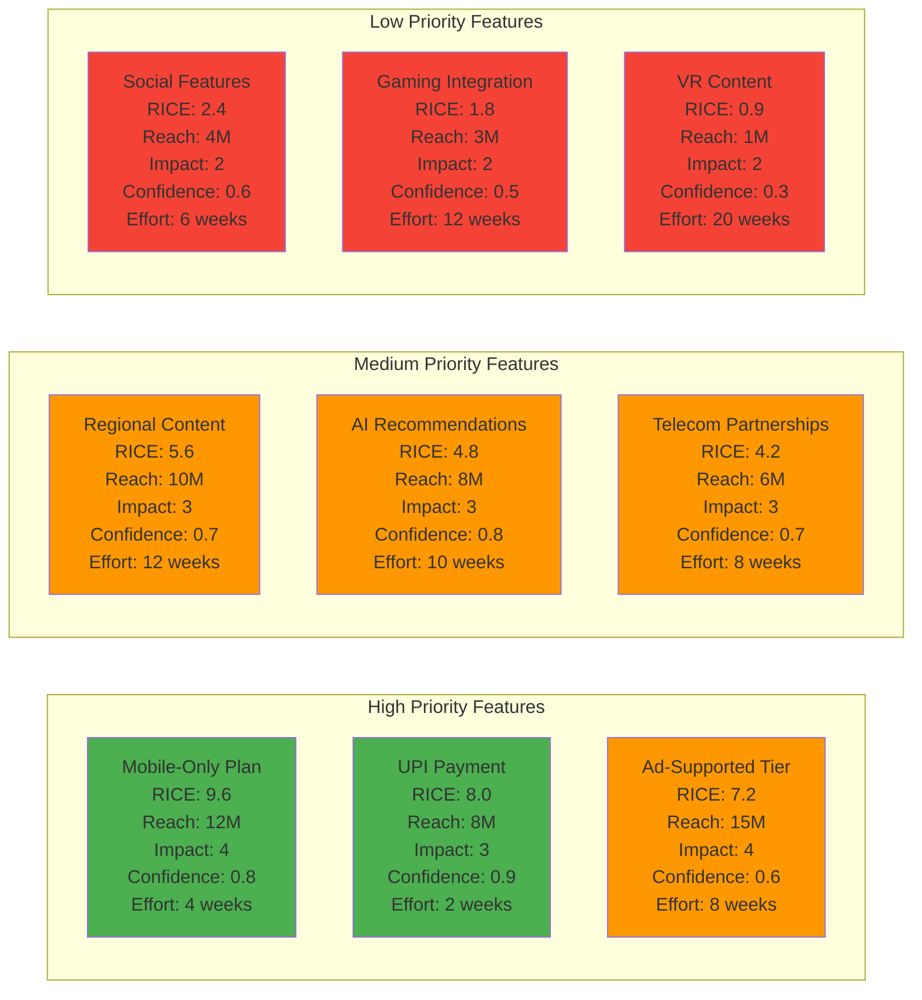

# Feature Prioritization Matrix - Netflix India

## RICE Scoring Analysis

## Implementation Roadmap

### Phase 1 (Months 1-3): Quick Wins
- Mobile-Only Plan (₹199/month)
- UPI Payment Integration
- App Performance Optimization

### Phase 2 (Months 4-6): Strategic Features
- Ad-Supported Tier (₹149/month)
- Regional Content Expansion
- AI Recommendation Enhancement

### Phase 3 (Months 7-12): Growth Features
- Original Content Production
- Telecom Partnerships
- Advanced Personalization

### Phase 4 (Months 13-18): Innovation
- Social Features
- Gaming Integration
- Emerging Technologies
