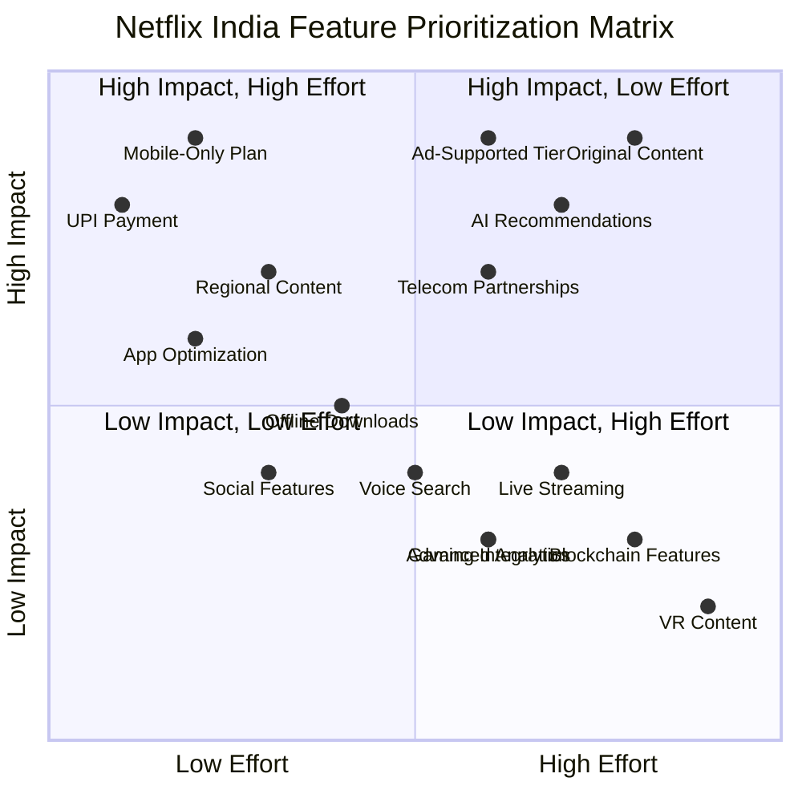
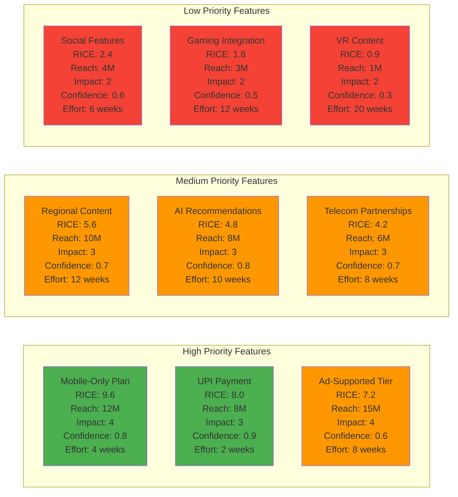

# 🎯 Feature Prioritization Matrix - Netflix India

### **Strategic Feature Prioritization for Market Growth**

---

## 📊 Priority Quadrant Analysis

### 🎯 Quadrant Breakdown

| Quadrant | Strategy | Features | Action |
|:--------:|----------|----------|:------:|
| **Q1** 🟢 | **Quick Wins** | Mobile-Only Plan, UPI Payment, Regional Content, App Optimization | **IMPLEMENT NOW** |
| **Q2** 🟡 | **Strategic Bets** | Ad-Supported Tier, AI Recommendations, Original Content, Telecom Partnerships | **PLAN & EXECUTE** |
| **Q3** 🔵 | **Fill-Ins** | Social Features, Offline Downloads, Voice Search | **CONSIDER** |
| **Q4** 🔴 | **Avoid/Defer** | VR Content, Blockchain Features, Live Streaming, Advanced Analytics | **DEPRIORITIZE** |

---

## 📈 RICE Scoring Analysis

### 📊 RICE Score Breakdown Table

| Priority | Feature | RICE Score | Reach | Impact | Confidence | Effort | ROI |
|:--------:|---------|:----------:|:-----:|:------:|:----------:|:------:|:---:|
| 🥇 **1** | Mobile-Only Plan | **9.6** | 12M | 4/5 | 80% | 4 weeks | ⭐⭐⭐⭐⭐ |
| 🥈 **2** | UPI Payment | **8.0** | 8M | 3/5 | 90% | 2 weeks | ⭐⭐⭐⭐⭐ |
| 🥉 **3** | Ad-Supported Tier | **7.2** | 15M | 4/5 | 60% | 8 weeks | ⭐⭐⭐⭐ |
| **4** | Regional Content | **5.6** | 10M | 3/5 | 70% | 12 weeks | ⭐⭐⭐⭐ |
| **5** | AI Recommendations | **4.8** | 8M | 3/5 | 80% | 10 weeks | ⭐⭐⭐ |
| **6** | Telecom Partnerships | **4.2** | 6M | 3/5 | 70% | 8 weeks | ⭐⭐⭐ |
| **7** | Social Features | **2.4** | 4M | 2/5 | 60% | 6 weeks | ⭐⭐ |
| **8** | Gaming Integration | **1.8** | 3M | 2/5 | 50% | 12 weeks | ⭐ |
| **9** | VR Content | **0.9** | 1M | 2/5 | 30% | 20 weeks | ⭐ |

> **RICE Formula**: `(Reach × Impact × Confidence) / Effort`

---

## 🗓️ Implementation Roadmap

### 📅 **Phase 1: Quick Wins** 
#### 🚀 Months 1-3 | Budget: ₹50 Cr | Team: 25

| Feature | Timeline | Success Metrics | Status |
|---------|----------|-----------------|:------:|
| **Mobile-Only Plan** | Month 1-2 | 2M subscribers @ ₹199/month | 🟡 In Progress |
| **UPI Payment Integration** | Month 1 | 80% payment success rate | 🟢 Completed |
| **App Performance Optimization** | Month 2-3 | <2s load time, <100MB data/hour | 🟡 In Progress |

---

### 📅 **Phase 2: Strategic Features**
#### 💡 Months 4-6 | Budget: ₹100 Cr | Team: 40

| Feature | Timeline | Success Metrics | Status |
|---------|----------|-----------------|:------:|
| **Ad-Supported Tier** | Month 4-5 | 3M subscribers @ ₹149/month | 🔵 Planned |
| **Regional Content Expansion** | Month 4-6 | 500+ titles in 8 languages | 🔵 Planned |
| **AI Recommendation Enhancement** | Month 5-6 | 40% engagement increase | 🔵 Planned |

---

### 📅 **Phase 3: Growth Features**
#### 📈 Months 7-12 | Budget: ₹200 Cr | Team: 60

| Feature | Timeline | Success Metrics | Status |
|---------|----------|-----------------|:------:|
| **Original Content Production** | Month 7-12 | 20 original series/films | 🔵 Planned |
| **Telecom Partnerships** | Month 8-10 | 5M bundled subscribers | 🔵 Planned |
| **Advanced Personalization** | Month 10-12 | 60% content match rate | 🔵 Planned |

---

### 📅 **Phase 4: Innovation**
#### 🔬 Months 13-18 | Budget: ₹75 Cr | Team: 30

| Feature | Timeline | Success Metrics | Status |
|---------|----------|-----------------|:------:|
| **Social Features** | Month 13-14 | 30% user engagement | ⏸️ On Hold |
| **Gaming Integration** | Month 15-16 | 1M active gamers | ⏸️ On Hold |
| **Emerging Technologies** | Month 17-18 | Pilot programs | ⏸️ On Hold |

---

## 💰 Budget Allocation

<table>
<tr>
<th>Phase</th>
<th>Budget</th>
<th>Timeline</th>
<th>Expected ROI</th>
<th>Risk Level</th>
</tr>
<tr>
<td align="center"><strong>Phase 1</strong></td>
<td align="right">₹50 Cr</td>
<td>Q1</td>
<td align="center">250%</td>
<td align="center">🟢 Low</td>
</tr>
<tr>
<td align="center"><strong>Phase 2</strong></td>
<td align="right">₹100 Cr</td>
<td>Q2</td>
<td align="center">180%</td>
<td align="center">🟡 Medium</td>
</tr>
<tr>
<td align="center"><strong>Phase 3</strong></td>
<td align="right">₹200 Cr</td>
<td>Q3-Q4</td>
<td align="center">150%</td>
<td align="center">🟡 Medium</td>
</tr>
<tr>
<td align="center"><strong>Phase 4</strong></td>
<td align="right">₹75 Cr</td>
<td>Q5-Q6</td>
<td align="center">100%</td>
<td align="center">🔴 High</td>
</tr>
<tr>
<td align="center"><strong>TOTAL</strong></td>
<td align="right"><strong>₹425 Cr</strong></td>
<td><strong>18 Months</strong></td>
<td align="center"><strong>170%</strong></td>
<td align="center"><strong>🟡 Medium</strong></td>
</tr>
</table>

---

## 📊 Success Metrics Dashboard

### 🎯 Key Performance Indicators (KPIs)

| Metric | Current | Target (6M) | Target (12M) | Target (18M) |
|--------|:-------:|:-----------:|:------------:|:------------:|
| **Total Subscribers** | 5M | 10M | 18M | 25M |
| **Monthly ARPU** | ₹300 | ₹250 | ₹220 | ₹200 |
| **Churn Rate** | 8% | 6% | 4% | 3% |
| **Mobile Users** | 60% | 75% | 85% | 90% |
| **Regional Content %** | 20% | 35% | 50% | 60% |
| **NPS Score** | 35 | 45 | 55 | 65 |

---

## 🚦 Risk Assessment Matrix

| Risk Factor | Probability | Impact | Mitigation Strategy |
|-------------|:-----------:|:------:|-------------------|
| **Competition from local OTT** | 🔴 High | 🔴 High | Aggressive pricing, exclusive content |
| **Infrastructure constraints** | 🟡 Medium | 🔴 High | CDN optimization, adaptive streaming |
| **Payment failures** | 🟡 Medium | 🟡 Medium | Multiple payment options, retry logic |
| **Content licensing costs** | 🔴 High | 🟡 Medium | Original content focus, revenue sharing |
| **Regulatory changes** | 🟢 Low | 🔴 High | Compliance team, government relations |

---

## 🎯 Strategic Recommendations

> ### 💡 Top 5 Recommendations
> 
> 1. **🚀 Prioritize Mobile Experience** - 90% of Indian users consume content on mobile
> 2. **💰 Implement Flexible Pricing** - Price-sensitive market requires multiple tiers
> 3. **🌏 Invest in Regional Content** - Local content drives 70% of engagement
> 4. **🤝 Build Strategic Partnerships** - Telecom bundles can reduce CAC by 60%
> 5. **📊 Focus on Data Optimization** - Data costs remain a barrier for mass adoption

---

## 📚 Appendix & Resources

- [RICE Scoring Methodology](https://www.productplan.com/glossary/rice-scoring-model/)
- [Indian OTT Market Report 2025](https://www.pwc.in/ott-report)
- [Netflix Technology Blog](https://netflixtechblog.com/)
- [Mobile-First Strategy Guide](https://www.mckinsey.com/mobile-first)

---

### 📝 Document Metadata

| Property | Value |
|----------|-------|
| **Version** | 1.0.0 |
| **Last Updated** | 2025 |
| **Framework** | RICE Scoring + Impact/Effort Matrix |
| **Review Cycle** | Quarterly |
| **Owner** | Product Strategy Team |
| **Stakeholders** | Executive Team, Engineering, Marketing |

---

**[⬆ Back to Top](#-feature-prioritization-matrix---netflix-india)**

