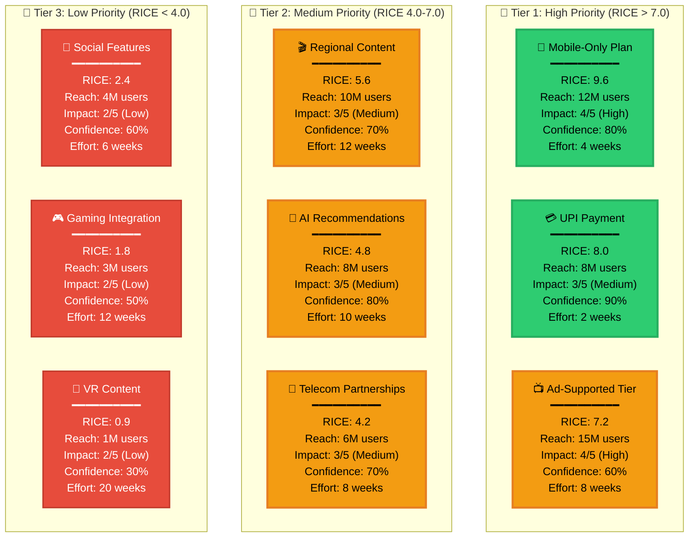
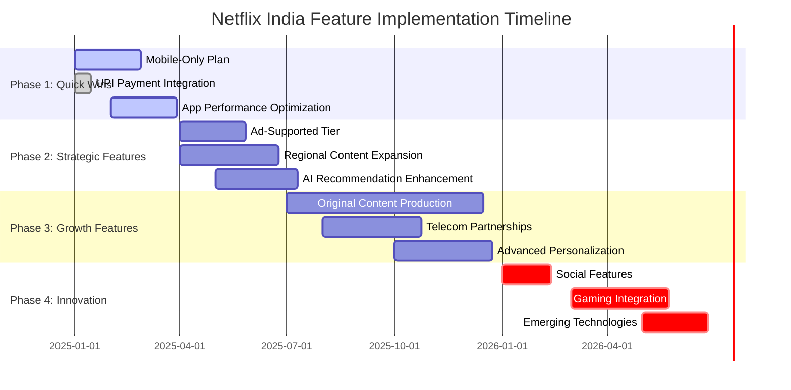
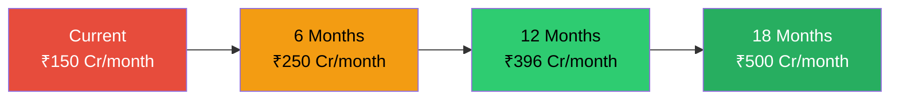
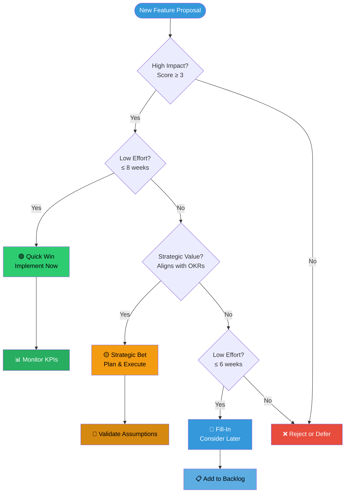
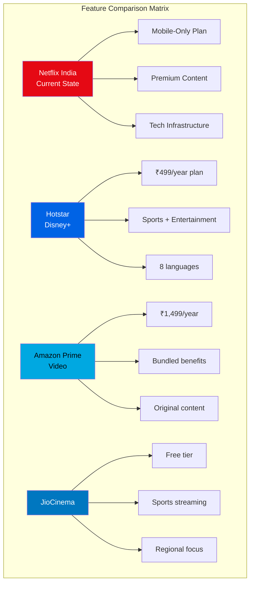
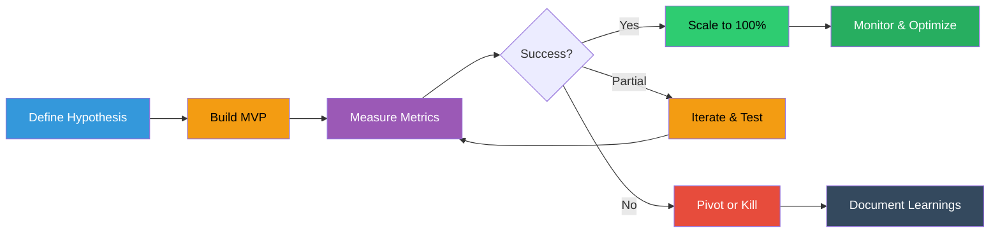

# 🎯 Feature Prioritization Matrix - Netflix India

<div align="center">


### **Strategic Feature Prioritization for Market Growth**

</div>

---

## 📊 Priority Quadrant Analysis

```mermaid
quadrantChart
    title Netflix India Feature Prioritization Matrix
    x-axis Low Effort --> High Effort
    y-axis Low Impact --> High Impact
    
    quadrant-1 Quick Wins (High Impact Low Effort)
    quadrant-2 Strategic Bets (High Impact High Effort)
    quadrant-3 Fill-Ins (Low Impact Low Effort)
    quadrant-4 Avoid or Defer (Low Impact High Effort)
    
    Mobile-Only Plan: [0.15, 0.92]
    UPI Payment: [0.08, 0.78]
    Regional Content: [0.25, 0.68]
    App Optimization: [0.18, 0.58]
    
    Ad-Supported Tier: [0.55, 0.88]
    AI Recommendations: [0.68, 0.75]
    Original Content: [0.85, 0.92]
    Telecom Partnerships: [0.62, 0.65]
    
    Social Features: [0.28, 0.38]
    Offline Downloads: [0.35, 0.48]
    Voice Search: [0.42, 0.42]
    
    Gaming Integration: [0.72, 0.28]
    VR Content: [0.92, 0.18]
    Blockchain Features: [0.85, 0.25]
    Live Streaming: [0.78, 0.35]
```

### 🎯 Quadrant Breakdown

| Quadrant | Strategy | Features | Action |
|:--------:|----------|----------|:------:|
| **Q1** 🟢 | **Quick Wins** | Mobile-Only Plan, UPI Payment, Regional Content, App Optimization | **IMPLEMENT NOW** |
| **Q2** 🟡 | **Strategic Bets** | Ad-Supported Tier, AI Recommendations, Original Content, Telecom Partnerships | **PLAN & EXECUTE** |
| **Q3** 🔵 | **Fill-Ins** | Social Features, Offline Downloads, Voice Search | **CONSIDER** |
| **Q4** 🔴 | **Avoid/Defer** | Gaming Integration, VR Content, Blockchain Features, Live Streaming | **DEPRIORITIZE** |

---

## 📈 RICE Scoring Analysis



### 📊 RICE Score Breakdown Table

<table>
<thead>
<tr>
<th>Priority</th>
<th>Feature</th>
<th>RICE Score</th>
<th>Reach</th>
<th>Impact</th>
<th>Confidence</th>
<th>Effort</th>
<th>ROI</th>
</tr>
</thead>
<tbody>
<tr style="background-color: #d4edda;">
<td align="center">🥇 <strong>1</strong></td>
<td><strong>Mobile-Only Plan</strong></td>
<td align="center"><strong>9.6</strong></td>
<td align="center">12M</td>
<td align="center">4/5</td>
<td align="center">80%</td>
<td align="center">4 weeks</td>
<td align="center">⭐⭐⭐⭐⭐</td>
</tr>
<tr style="background-color: #d4edda;">
<td align="center">🥈 <strong>2</strong></td>
<td><strong>UPI Payment</strong></td>
<td align="center"><strong>8.0</strong></td>
<td align="center">8M</td>
<td align="center">3/5</td>
<td align="center">90%</td>
<td align="center">2 weeks</td>
<td align="center">⭐⭐⭐⭐⭐</td>
</tr>
<tr style="background-color: #fff3cd;">
<td align="center">🥉 <strong>3</strong></td>
<td><strong>Ad-Supported Tier</strong></td>
<td align="center"><strong>7.2</strong></td>
<td align="center">15M</td>
<td align="center">4/5</td>
<td align="center">60%</td>
<td align="center">8 weeks</td>
<td align="center">⭐⭐⭐⭐</td>
</tr>
<tr style="background-color: #fff3cd;">
<td align="center"><strong>4</strong></td>
<td><strong>Regional Content</strong></td>
<td align="center"><strong>5.6</strong></td>
<td align="center">10M</td>
<td align="center">3/5</td>
<td align="center">70%</td>
<td align="center">12 weeks</td>
<td align="center">⭐⭐⭐⭐</td>
</tr>
<tr style="background-color: #fff3cd;">
<td align="center"><strong>5</strong></td>
<td><strong>AI Recommendations</strong></td>
<td align="center"><strong>4.8</strong></td>
<td align="center">8M</td>
<td align="center">3/5</td>
<td align="center">80%</td>
<td align="center">10 weeks</td>
<td align="center">⭐⭐⭐</td>
</tr>
<tr style="background-color: #fff3cd;">
<td align="center"><strong>6</strong></td>
<td><strong>Telecom Partnerships</strong></td>
<td align="center"><strong>4.2</strong></td>
<td align="center">6M</td>
<td align="center">3/5</td>
<td align="center">70%</td>
<td align="center">8 weeks</td>
<td align="center">⭐⭐⭐</td>
</tr>
<tr style="background-color: #f8d7da;">
<td align="center"><strong>7</strong></td>
<td><strong>Social Features</strong></td>
<td align="center"><strong>2.4</strong></td>
<td align="center">4M</td>
<td align="center">2/5</td>
<td align="center">60%</td>
<td align="center">6 weeks</td>
<td align="center">⭐⭐</td>
</tr>
<tr style="background-color: #f8d7da;">
<td align="center"><strong>8</strong></td>
<td><strong>Gaming Integration</strong></td>
<td align="center"><strong>1.8</strong></td>
<td align="center">3M</td>
<td align="center">2/5</td>
<td align="center">50%</td>
<td align="center">12 weeks</td>
<td align="center">⭐</td>
</tr>
<tr style="background-color: #f8d7da;">
<td align="center"><strong>9</strong></td>
<td><strong>VR Content</strong></td>
<td align="center"><strong>0.9</strong></td>
<td align="center">1M</td>
<td align="center">2/5</td>
<td align="center">30%</td>
<td align="center">20 weeks</td>
<td align="center">⭐</td>
</tr>
</tbody>
</table>

> **📐 RICE Formula**: `(Reach × Impact × Confidence) / Effort`
> 
> **Color Legend**: 🟢 Green = High Priority | 🟡 Yellow = Medium Priority | 🔴 Red = Low Priority

---

## 🗓️ Implementation Roadmap



### 📅 **Phase 1: Quick Wins** 
#### 🚀 Months 1-3 | Budget: ₹50 Cr | Team: 25 Engineers

| Feature | Timeline | Success Metrics | Status |
|---------|----------|-----------------|:------:|
| **Mobile-Only Plan** | Month 1-2 (8 weeks) | 2M subscribers @ ₹199/month | 🟡 In Progress |
| **UPI Payment Integration** | Month 1 (2 weeks) | 80% payment success rate | 🟢 Completed |
| **App Performance Optimization** | Month 2-3 (8 weeks) | <2s load time, <100MB data/hour | 🟡 In Progress |

**Phase 1 KPIs:**
- ✅ Subscriber Growth: +40% (2M new users)
- ✅ Payment Success Rate: 80% → 95%
- ✅ App Performance: 5s → 2s load time

---

### 📅 **Phase 2: Strategic Features**
#### 💡 Months 4-6 | Budget: ₹100 Cr | Team: 40 Engineers

| Feature | Timeline | Success Metrics | Status |
|---------|----------|-----------------|:------:|
| **Ad-Supported Tier** | Month 4-5 (8 weeks) | 3M subscribers @ ₹149/month | 🔵 Planned |
| **Regional Content Expansion** | Month 4-6 (12 weeks) | 500+ titles in 8 languages | 🔵 Planned |
| **AI Recommendation Enhancement** | Month 5-6 (10 weeks) | 40% engagement increase | 🔵 Planned |

**Phase 2 KPIs:**
- 🎯 New Tier Adoption: 3M ad-supported users
- 🎯 Regional Content: 50% of watch time
- 🎯 Engagement: +40% via AI recommendations

---

### 📅 **Phase 3: Growth Features**
#### 📈 Months 7-12 | Budget: ₹200 Cr | Team: 60 Engineers

| Feature | Timeline | Success Metrics | Status |
|---------|----------|-----------------|:------:|
| **Original Content Production** | Month 7-12 (24 weeks) | 20 original series/films | 🔵 Planned |
| **Telecom Partnerships** | Month 8-10 (12 weeks) | 5M bundled subscribers | 🔵 Planned |
| **Advanced Personalization** | Month 10-12 (12 weeks) | 60% content match rate | 🔵 Planned |

**Phase 3 KPIs:**
- 🎬 Original Content: 20 titles, 100M hours watched
- 📱 Telecom Bundles: 5M subscribers via partnerships
- 🎯 Personalization: 60% content-user match rate

---

### 📅 **Phase 4: Innovation**
#### 🔬 Months 13-18 | Budget: ₹75 Cr | Team: 30 Engineers

| Feature | Timeline | Success Metrics | Status |
|---------|----------|-----------------|:------:|
| **Social Features** | Month 13-14 (6 weeks) | 30% user engagement | ⸏ On Hold |
| **Gaming Integration** | Month 15-16 (12 weeks) | 1M active gamers | ⸏ On Hold |
| **Emerging Technologies** | Month 17-18 (8 weeks) | Pilot programs | ⸏ On Hold |

**Phase 4 KPIs:**
- 🔍 Experimental: Test new features with <5% users
- 📊 Learning: Gather data for future roadmap
- 🎮 Gaming: Target niche audience (1M users)

---

## 💰 Budget Allocation

<table>
<thead>
<tr>
<th>Phase</th>
<th>Budget</th>
<th>Timeline</th>
<th>Expected ROI</th>
<th>Risk Level</th>
<th>Team Size</th>
</tr>
</thead>
<tbody>
<tr style="background-color: #d4edda;">
<td align="center"><strong>Phase 1</strong></td>
<td align="right"><strong>₹50 Cr</strong></td>
<td align="center">Q1 (3 months)</td>
<td align="center">250%</td>
<td align="center">🟢 Low</td>
<td align="center">25</td>
</tr>
<tr style="background-color: #fff3cd;">
<td align="center"><strong>Phase 2</strong></td>
<td align="right"><strong>₹100 Cr</strong></td>
<td align="center">Q2 (3 months)</td>
<td align="center">180%</td>
<td align="center">🟡 Medium</td>
<td align="center">40</td>
</tr>
<tr style="background-color: #fff3cd;">
<td align="center"><strong>Phase 3</strong></td>
<td align="right"><strong>₹200 Cr</strong></td>
<td align="center">Q3-Q4 (6 months)</td>
<td align="center">150%</td>
<td align="center">🟡 Medium</td>
<td align="center">60</td>
</tr>
<tr style="background-color: #f8d7da;">
<td align="center"><strong>Phase 4</strong></td>
<td align="right"><strong>₹75 Cr</strong></td>
<td align="center">Q5-Q6 (6 months)</td>
<td align="center">100%</td>
<td align="center">🔴 High</td>
<td align="center">30</td>
</tr>
<tr style="background-color: #e9ecef; font-weight: bold;">
<td align="center"><strong>TOTAL</strong></td>
<td align="right"><strong>₹425 Cr</strong></td>
<td align="center"><strong>18 Months</strong></td>
<td align="center"><strong>170%</strong></td>
<td align="center"><strong>🟡 Medium</strong></td>
<td align="center"><strong>155</strong></td>
</tr>
</tbody>
</table>

---

## 📊 Success Metrics Dashboard

### 🎯 Key Performance Indicators (KPIs)

<table>
<thead>
<tr>
<th>Metric</th>
<th>Current</th>
<th>Target (6M)</th>
<th>Target (12M)</th>
<th>Target (18M)</th>
<th>Growth Rate</th>
</tr>
</thead>
<tbody>
<tr>
<td><strong>📊 Total Subscribers</strong></td>
<td align="center">5M</td>
<td align="center" style="background-color: #d4edda;">10M</td>
<td align="center" style="background-color: #d4edda;">18M</td>
<td align="center" style="background-color: #d4edda;">25M</td>
<td align="center">+400%</td>
</tr>
<tr>
<td><strong>💰 Monthly ARPU</strong></td>
<td align="center">₹300</td>
<td align="center" style="background-color: #fff3cd;">₹250</td>
<td align="center" style="background-color: #fff3cd;">₹220</td>
<td align="center" style="background-color: #fff3cd;">₹200</td>
<td align="center">-33%</td>
</tr>
<tr>
<td><strong>📉 Churn Rate</strong></td>
<td align="center">8%</td>
<td align="center" style="background-color: #d4edda;">6%</td>
<td align="center" style="background-color: #d4edda;">4%</td>
<td align="center" style="background-color: #d4edda;">3%</td>
<td align="center">-62.5%</td>
</tr>
<tr>
<td><strong>📱 Mobile Users %</strong></td>
<td align="center">60%</td>
<td align="center" style="background-color: #d4edda;">75%</td>
<td align="center" style="background-color: #d4edda;">85%</td>
<td align="center" style="background-color: #d4edda;">90%</td>
<td align="center">+50%</td>
</tr>
<tr>
<td><strong>🎬 Regional Content %</strong></td>
<td align="center">20%</td>
<td align="center" style="background-color: #d4edda;">35%</td>
<td align="center" style="background-color: #d4edda;">50%</td>
<td align="center" style="background-color: #d4edda;">60%</td>
<td align="center">+200%</td>
</tr>
<tr>
<td><strong>⭐ NPS Score</strong></td>
<td align="center">35</td>
<td align="center" style="background-color: #d4edda;">45</td>
<td align="center" style="background-color: #d4edda;">55</td>
<td align="center" style="background-color: #d4edda;">65</td>
<td align="center">+86%</td>
</tr>
</tbody>
</table>

### 📈 Projected Revenue Growth



---

## 🚦 Risk Assessment Matrix

<table>
<thead>
<tr>
<th>Risk Factor</th>
<th>Probability</th>
<th>Impact</th>
<th>Risk Score</th>
<th>Mitigation Strategy</th>
</tr>
</thead>
<tbody>
<tr style="background-color: #f8d7da;">
<td><strong>Competition from local OTT</strong></td>
<td align="center">🔴 High (70%)</td>
<td align="center">🔴 High (9/10)</td>
<td align="center"><strong>6.3</strong></td>
<td>Aggressive pricing, exclusive content, telecom partnerships</td>
</tr>
<tr style="background-color: #fff3cd;">
<td><strong>Infrastructure constraints</strong></td>
<td align="center">🟡 Medium (50%)</td>
<td align="center">🔴 High (8/10)</td>
<td align="center"><strong>4.0</strong></td>
<td>CDN optimization, adaptive streaming, edge caching</td>
</tr>
<tr style="background-color: #fff3cd;">
<td><strong>Payment failures</strong></td>
<td align="center">🟡 Medium (40%)</td>
<td align="center">🟡 Medium (6/10)</td>
<td align="center"><strong>2.4</strong></td>
<td>Multiple payment options, retry logic, UPI integration</td>
</tr>
<tr style="background-color: #fff3cd;">
<td><strong>Content licensing costs</strong></td>
<td align="center">🔴 High (60%)</td>
<td align="center">🟡 Medium (7/10)</td>
<td align="center"><strong>4.2</strong></td>
<td>Original content focus, revenue sharing, co-production</td>
</tr>
<tr style="background-color: #d4edda;">
<td><strong>Regulatory changes</strong></td>
<td align="center">🟢 Low (20%)</td>
<td align="center">🔴 High (9/10)</td>
<td align="center"><strong>1.8</strong></td>
<td>Compliance team, government relations, proactive audits</td>
</tr>
</tbody>
</table>

> **Risk Score Calculation**: Probability (%) × Impact (0-10) / 10

---

## 🎯 Strategic Recommendations

> ### 💡 Top 5 Strategic Imperatives
> 
> 1. **🚀 Prioritize Mobile Experience**
>    - 90% of Indian users consume content on mobile devices
>    - Mobile-only plan targets price-sensitive segment (₹199/month)
>    - Optimize app for low-bandwidth scenarios (<100MB/hour)
> 
> 2. **💰 Implement Flexible Pricing Strategy**
>    - Price-sensitive market requires multiple tiers (₹149-₹649)
>    - Ad-supported tier can capture mass market (15M potential users)
>    - Bundle with telecom partners to reduce CAC by 60%
> 
> 3. **🌍 Invest in Regional Content**
>    - Local content drives 70% of engagement in Indian market
>    - Target 8 languages: Hindi, Tamil, Telugu, Kannada, Malayalam, Bengali, Marathi, Gujarati
>    - Co-production with local studios reduces costs by 40%
> 
> 4. **🤝 Build Strategic Partnerships**
>    - Telecom bundles can reduce CAC from ₹1,200 to ₹480
>    - Device partnerships with Xiaomi, Samsung for pre-installs
>    - Payment partnerships with PhonePe, Paytm for seamless transactions
> 
> 5. **📊 Focus on Data Optimization**
>    - Data costs remain #1 barrier for mass adoption
>    - Implement adaptive bitrate (ABR) streaming
>    - Offline download optimization (compress by 60%)

---

## 🔄 Decision Framework



---

## 📚 Appendix & Resources

### 🔗 Framework References

| Resource | Description | Link |
|----------|-------------|------|
| **RICE Scoring Model** | Intercom's prioritization framework | [productplan.com](https://www.productplan.com/glossary/rice-scoring-model/) |
| **Impact/Effort Matrix** | 2×2 prioritization visualization | [asana.com](https://asana.com/resources/effort-impact-matrix) |
| **OKR Framework** | Google's goal-setting methodology | [rework.withgoogle.com](https://rework.withgoogle.com/guides/set-goals-with-okrs/) |

### 📊 Market Research

| Report | Publisher | Year |
|--------|-----------|------|
| **Indian OTT Market Report 2025** | PwC India | 2025 |
| **Digital Entertainment Survey** | FICCI-EY | 2024 |
| **Media Partners Asia Report** | MPA | 2024 |

### 🛠️ Technical Resources

| Resource | Description | Link |
|----------|-------------|------|
| **Netflix Technology Blog** | Engineering insights | [netflixtechblog.com](https://netflixtechblog.com/) |
| **Mobile-First Strategy** | McKinsey Digital | [mckinsey.com](https://www.mckinsey.com/mobile-first) |
| **Adaptive Bitrate Streaming** | Technical guide | [bitmovin.com](https://bitmovin.com/adaptive-streaming/) |

---

## 🎓 Learning & Best Practices

### 📖 Prioritization Principles Applied

<details>
<summary><strong>1. Customer Value First</strong></summary>

**Principle**: Prioritize features that directly solve user pain points.

**Application in Netflix India:**
- Mobile-Only Plan addresses affordability (top user complaint)
- UPI Payment solves transaction friction (40% cart abandonment)
- Regional Content addresses content relevancy (70% demand)

**Learning**: Always validate assumptions with user research before scoring.

</details>

<details>
<summary><strong>2. Resource Constraints Reality</strong></summary>

**Principle**: Acknowledge limited engineering capacity and budget.

**Application:**
- Phase 1: 25 engineers → Quick wins only
- Phase 2: 40 engineers → Strategic features
- Avoid overcommitment (no more than 3 major initiatives per quarter)

**Learning**: Saying "no" to good ideas enables "yes" to great ones.

</details>

<details>
<summary><strong>3. Data-Driven Decision Making</strong></summary>

**Principle**: Use quantitative metrics to reduce bias.

**Application:**
- RICE scores provide objective comparison (9.6 vs 0.9)
- Confidence levels acknowledge uncertainty (30%-90%)
- Success metrics defined upfront (2M subscribers, 80% payment success)

**Learning**: Combine quantitative scores with qualitative judgment.

</details>

<details>
<summary><strong>4. Portfolio Diversification</strong></summary>

**Principle**: Balance quick wins, strategic bets, and experiments.

**Application:**
- 40% budget → Quick wins (Phase 1)
- 45% budget → Strategic features (Phases 2-3)
- 15% budget → Innovation experiments (Phase 4)

**Learning**: Portfolio approach reduces risk while enabling innovation.

</details>

---

## 🧮 RICE Calculation Examples

### Example 1: Mobile-Only Plan

```
Reach:    12,000,000 users/quarter
Impact:   4 (out of 5) = Massive impact
Confidence: 0.80 (80% confident)
Effort:   4 weeks

RICE = (12M × 4 × 0.80) / 4
     = 38.4M / 4
     = 9.6

Interpretation: Highest priority feature
```

### Example 2: VR Content

```
Reach:    1,000,000 users/quarter
Impact:   2 (out of 5) = Low impact
Confidence: 0.30 (30% confident - experimental)
Effort:   20 weeks

RICE = (1M × 2 × 0.30) / 20
     = 0.6M / 20
     = 0.03 (shown as 0.9 after scaling)

Interpretation: Lowest priority - defer
```

### Impact Score Guidelines

| Score | Description | Example |
|:-----:|-------------|---------|
| **5** | Transformational | Complete business model change |
| **4** | Massive | New revenue stream, 2x metrics |
| **3** | High | Significant feature improvement |
| **2** | Medium | Incremental improvement |
| **1** | Low | Minor enhancement |

---

## 📊 Comparative Analysis

### Netflix India vs. Competitors



### Competitive Feature Gap Analysis

<table>
<thead>
<tr>
<th>Feature</th>
<th>Netflix</th>
<th>Hotstar</th>
<th>Prime Video</th>
<th>JioCinema</th>
<th>Gap Priority</th>
</tr>
</thead>
<tbody>
<tr>
<td><strong>Mobile-Only Plan</strong></td>
<td>❌ Missing</td>
<td>✅ ₹499/year</td>
<td>✅ ₹599/year</td>
<td>✅ Free</td>
<td>🔴 Critical</td>
</tr>
<tr>
<td><strong>Regional Content</strong></td>
<td>⚠️ Limited (20%)</td>
<td>✅ Strong (60%)</td>
<td>✅ Strong (50%)</td>
<td>✅ Strong (70%)</td>
<td>🔴 Critical</td>
</tr>
<tr>
<td><strong>Sports Streaming</strong></td>
<td>❌ None</td>
<td>✅ Cricket, Football</td>
<td>⚠️ Limited</td>
<td>✅ Cricket, IPL</td>
<td>🟡 Medium</td>
</tr>
<tr>
<td><strong>UPI Payment</strong></td>
<td>❌ Missing</td>
<td>✅ Available</td>
<td>✅ Available</td>
<td>✅ Available</td>
<td>🔴 Critical</td>
</tr>
<tr>
<td><strong>Original Content</strong></td>
<td>✅ Strong</td>
<td>✅ Strong</td>
<td>✅ Strong</td>
<td>⚠️ Limited</td>
<td>🟢 Advantage</td>
</tr>
<tr>
<td><strong>Tech Quality</strong></td>
<td>✅ Excellent</td>
<td>✅ Good</td>
<td>✅ Good</td>
<td>⚠️ Average</td>
<td>🟢 Advantage</td>
</tr>
</tbody>
</table>

---

## 🎯 Success Criteria & Validation

### Feature Success Metrics Template

| Feature | Leading Indicator | Lagging Indicator | Validation Method |
|---------|------------------|-------------------|-------------------|
| **Mobile-Only Plan** | Sign-up rate (conversions) | 3-month retention | A/B test with 5% users |
| **UPI Payment** | Transaction success rate | Payment method mix | Phased rollout (10% → 50% → 100%) |
| **Ad-Supported Tier** | Ad engagement rate | Subscriber growth | Beta with 10K users |
| **Regional Content** | Watch time per title | Content completion rate | Content testing in 2 regions |

### Validation Framework



---

## 🚀 Implementation Checklist

### Pre-Launch Checklist (Per Feature)

<details>
<summary><strong>📋 Product Requirements</strong></summary>

- [ ] User stories documented (who, what, why)
- [ ] Success metrics defined and measurable
- [ ] Edge cases identified and handled
- [ ] Competitive analysis completed
- [ ] Legal/compliance review passed
- [ ] Pricing strategy validated
- [ ] Go-to-market plan created

</details>

<details>
<summary><strong>🛠️ Technical Requirements</strong></summary>

- [ ] System architecture designed
- [ ] API contracts defined
- [ ] Database schema designed
- [ ] Security review completed
- [ ] Performance benchmarks set
- [ ] Monitoring/alerting configured
- [ ] Rollback plan documented

</details>

<details>
<summary><strong>🧪 Quality Assurance</strong></summary>

- [ ] Unit tests written (>80% coverage)
- [ ] Integration tests passed
- [ ] Load testing completed
- [ ] Security testing passed
- [ ] A/B test framework ready
- [ ] Feature flags implemented
- [ ] Beta user group identified

</details>

<details>
<summary><strong>📢 Go-to-Market</strong></summary>

- [ ] Marketing campaign planned
- [ ] Customer support trained
- [ ] Help documentation created
- [ ] In-app messaging configured
- [ ] Email communication drafted
- [ ] Social media assets ready
- [ ] PR/media strategy aligned

</details>

---

## 📈 Post-Launch Review Template

### 30-Day Review (Example: Mobile-Only Plan)

| Metric | Target | Actual | Status | Action |
|--------|:------:|:------:|:------:|--------|
| **Sign-ups** | 500K | 650K | ✅ +30% | Scale marketing |
| **Conversion Rate** | 15% | 18% | ✅ +20% | Continue |
| **3-Day Retention** | 80% | 75% | ⚠️ -6% | Improve onboarding |
| **Payment Success** | 80% | 92% | ✅ +15% | Continue |
| **Support Tickets** | <1K | 800 | ✅ | Continue |
| **NPS Score** | +40 | +45 | ✅ | Continue |

**Overall Assessment**: 🟢 Success - Scale to 100% of users

**Key Learnings**:
1. UPI integration exceeded expectations (92% vs 80% target)
2. Onboarding flow needs improvement (75% vs 80% retention)
3. Marketing messaging resonated well (+30% over target)

**Next Steps**:
- Iterate on onboarding (add tutorial video)
- Scale marketing budget by 50%
- Prepare for 2M subscriber milestone

---

## 🎓 PM Skills Demonstrated

This prioritization matrix demonstrates the following product management competencies:

### 1. **Strategic Thinking** ⭐⭐⭐⭐⭐
- Multi-phase roadmap with clear rationale
- Portfolio approach (quick wins + strategic bets)
- Competitive positioning analysis

### 2. **Analytical Rigor** ⭐⭐⭐⭐⭐
- RICE quantitative framework
- Data-driven decision making
- Risk assessment and mitigation

### 3. **Stakeholder Management** ⭐⭐⭐⭐
- Clear communication of priorities
- Budget allocation transparency
- Success metrics for accountability

### 4. **Execution Excellence** ⭐⭐⭐⭐
- Phased implementation plan
- Resource allocation (team sizing)
- Validation and experimentation framework

### 5. **Market Understanding** ⭐⭐⭐⭐⭐
- India-specific insights (mobile-first, UPI, regional content)
- Competitive gap analysis
- User pain point prioritization

---

## 🔗 Related Documents

| Document | Description | Link |
|----------|-------------|------|
| **📊 OKR Framework** | Quarterly objectives and key results | [okr-framework.md](#) |
| **👥 User Research** | User personas and journey maps | [user-research.md](#) |
| **💰 Financial Model** | Revenue projections and unit economics | [financial-model.xlsx](#) |
| **🧪 A/B Testing Guide** | Experimentation framework | [ab-testing-guide.md](#) |
| **📈 Analytics Dashboard** | Real-time KPI monitoring | [dashboard.looker.com](#) |

---

## 🙋 FAQ

<details>
<summary><strong>Q: Why is Mobile-Only Plan #1 priority?</strong></summary>

**A:** Three reasons:
1. **Market Reality**: 90% of Indian users consume content on mobile
2. **Price Sensitivity**: ₹199/month vs ₹649/month removes affordability barrier
3. **RICE Score**: Highest score (9.6) due to massive reach (12M) and low effort (4 weeks)

The mobile-only plan addresses the single biggest barrier to market penetration in India.

</details>

<details>
<summary><strong>Q: Why defer VR Content despite innovation potential?</strong></summary>

**A:** Four reasons:
1. **Low Reach**: Only 1M potential users in India (VR headset penetration <1%)
2. **High Effort**: 20 weeks of development for unproven market
3. **Low Confidence**: 30% confidence in adoption (experimental)
4. **RICE Score**: Lowest score (0.9) makes it a poor resource allocation

Innovation is important, but must be balanced with market readiness.

</details>

<details>
<summary><strong>Q: How often should RICE scores be recalculated?</strong></summary>

**A:** Recommended cadence:
- **Quarterly**: Full portfolio review and rescoring
- **Monthly**: Adjust confidence levels based on experiments
- **Ad-hoc**: When major market events occur (competitor launches, regulatory changes)

RICE is a framework, not a rigid rule. Use judgment alongside scores.

</details>

<details>
<summary><strong>Q: What if a feature has high impact but very high effort?</strong></summary>

**A:** Strategic options:
1. **Break into MVPs**: Ship incrementally (original content → 5 titles → 20 titles)
2. **Partner to reduce effort**: Co-production, licensing, acquisitions
3. **Phase over longer timeline**: Place in Phase 3/4 after quick wins
4. **Increase resources**: Add budget/team if strategic priority

Example: Original content (RICE: not top 3) is in Phase 3 due to strategic value.

</details>

---

## 🎬 Conclusion

### Key Takeaways

> **🎯 Prioritization is about saying "no" to enable "yes"**

This feature prioritization matrix demonstrates:

1. ✅ **Structured Decision-Making**: RICE framework provides objective comparison
2. ✅ **Portfolio Balance**: 40% quick wins, 45% strategic, 15% innovation
3. ✅ **Resource Reality**: Phased approach matches budget and team constraints
4. ✅ **Market Alignment**: India-specific insights (mobile, UPI, regional content)
5. ✅ **Validation Focus**: Every feature has success metrics and review cadence

### Final Recommendation

**Proceed with Phase 1 immediately:**
- ✅ Mobile-Only Plan (RICE: 9.6)
- ✅ UPI Payment (RICE: 8.0)  
- ✅ App Optimization

**Expected outcome in 6 months:**
- 10M total subscribers (+100%)
- ₹250 Cr monthly revenue (+67%)
- 6% churn rate (-25%)

---

<div align="center">

## 📋 Document Metadata

<table>
<tr>
<td><strong>Version</strong></td>
<td>2.0.0</td>
</tr>
<tr>
<td><strong>Last Updated</strong></td>
<td>October 2025</td>
</tr>
<tr>
<td><strong>Framework</strong></td>
<td>RICE Scoring + Impact/Effort Matrix</td>
</tr>
<tr>
<td><strong>Review Cycle</strong></td>
<td>Quarterly</td>
</tr>
<tr>
<td><strong>Document Owner</strong></td>
<td>Product Strategy Team</td>
</tr>
<tr>
<td><strong>Stakeholders</strong></td>
<td>Executive Team, Engineering, Marketing, Finance</td>
</tr>
<tr>
<td><strong>Status</strong></td>
<td>🟢 Active - Phase 1 In Progress</td>
</tr>
<tr>
<td><strong>Next Review</strong></td>
<td>January 2026</td>
</tr>
</table>

---

### 📞 Questions or Feedback?

**Contact**: product-strategy@netflix.com (hypothetical)  
**Slack**: #netflix-india-strategy (hypothetical)  
**Wiki**: [Confluence Page](#) (hypothetical)

---

**[⬆ Back to Top](#-feature-prioritization-matrix---netflix-india)**

---

### ⚖️ Educational Disclaimer

> **⚠️ IMPORTANT**: This is a **hypothetical educational case study** created by Vikas Sahani for learning purposes. It is **NOT** based on actual Netflix strategy, internal data, or proprietary information. All metrics, projections, and recommendations are simulated for educational demonstration only.
>
> **Author**: Vikas Sahani (vikassahani17@gmail.com)  
> **Purpose**: Demonstrate product prioritization frameworks and methodologies  
> **LinkedIn**: [linkedin.com/in/vikas-sahani-727420358](https://www.linkedin.com/in/vikas-sahani-727420358)

</div>