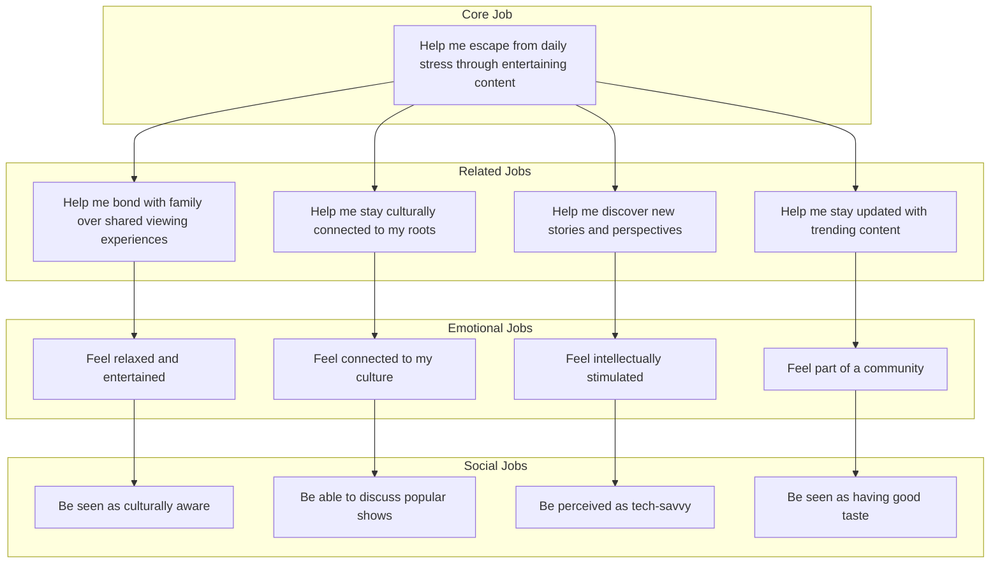
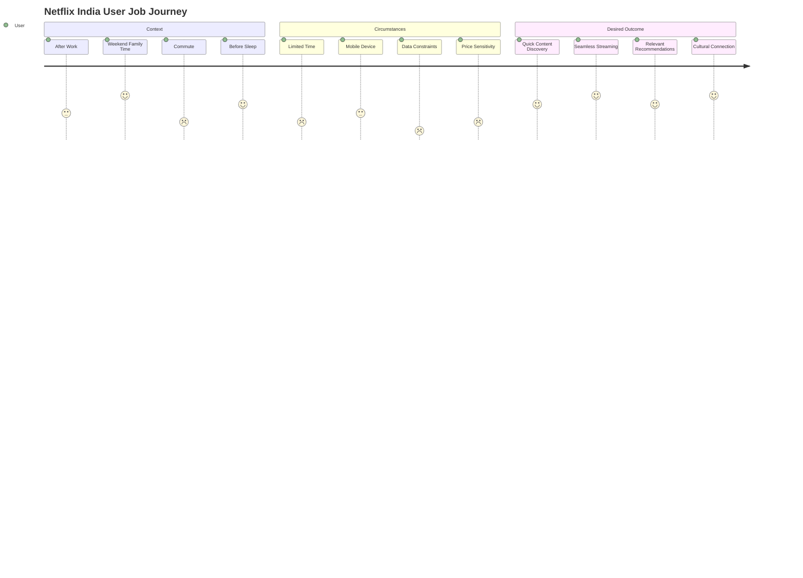
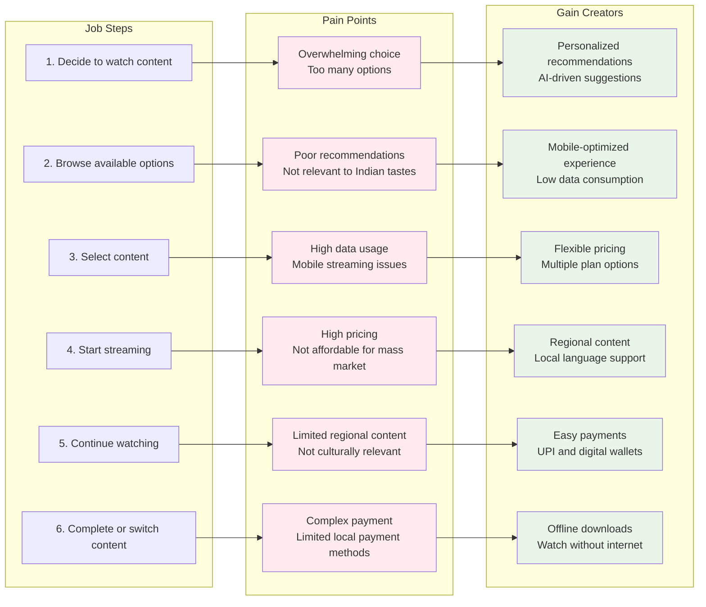
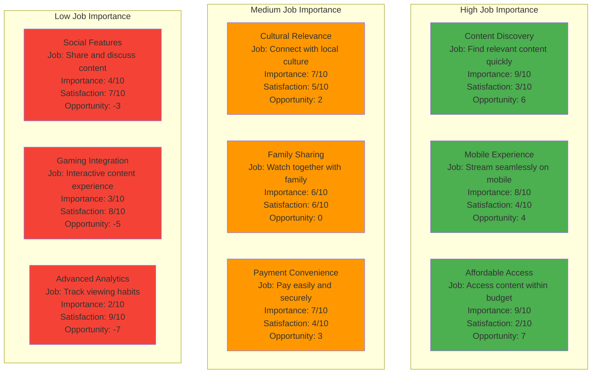

# 🎬 Jobs-to-be-Done Framework - Netflix India

---

## 📊 Core Job Architecture

---

## 🎯 Job Context and Circumstances

---

## 🗺️ Job Mapping and Pain Points

---

## 📈 Job-Based Feature Prioritization

### 📊 Priority Matrix

| Priority | Feature | Importance | Satisfaction | Opportunity Score |
|:--------:|---------|:----------:|:------------:|:-----------------:|
| 🔴 **HIGH** | Affordable Access | 9/10 | 2/10 | **+7** |
| 🔴 **HIGH** | Content Discovery | 9/10 | 3/10 | **+6** |
| 🔴 **HIGH** | Mobile Experience | 8/10 | 4/10 | **+4** |
| 🟡 **MEDIUM** | Payment Convenience | 7/10 | 4/10 | **+3** |
| 🟡 **MEDIUM** | Cultural Relevance | 7/10 | 5/10 | **+2** |
| 🟡 **MEDIUM** | Family Sharing | 6/10 | 6/10 | **0** |
| 🟢 **LOW** | Social Features | 4/10 | 7/10 | **-3** |
| 🟢 **LOW** | Gaming Integration | 3/10 | 8/10 | **-5** |
| 🟢 **LOW** | Advanced Analytics | 2/10 | 9/10 | **-7** |

---

## 💡 Job-Based Value Proposition

### 📌 Current Value Proposition

<table>
<tr>
<th width="20%">Component</th>
<th width="80%">Description</th>
</tr>
<tr>
<td><strong>For</strong></td>
<td>Indian streaming users</td>
</tr>
<tr>
<td><strong>Who</strong></td>
<td>Want high-quality entertainment</td>
</tr>
<tr>
<td><strong>Netflix India</strong></td>
<td>Is a premium streaming platform</td>
</tr>
<tr>
<td><strong>That</strong></td>
<td>Provides global content and original series</td>
</tr>
<tr>
<td><strong>Unlike</strong></td>
<td>Competitors with limited content</td>
</tr>
<tr>
<td><strong>Our product</strong></td>
<td>Offers superior quality and exclusive content</td>
</tr>
</table>

### 🚀 Improved Value Proposition

<table>
<tr>
<th width="20%">Component</th>
<th width="80%">Description</th>
</tr>
<tr>
<td><strong>For</strong></td>
<td>Indian streaming users</td>
</tr>
<tr>
<td><strong>Who</strong></td>
<td>Want affordable, culturally relevant entertainment</td>
</tr>
<tr>
<td><strong>Netflix India</strong></td>
<td>Is a mobile-first streaming platform</td>
</tr>
<tr>
<td><strong>That</strong></td>
<td>Provides personalized, regional content</td>
</tr>
<tr>
<td><strong>Unlike</strong></td>
<td>Competitors with poor mobile experience</td>
</tr>
<tr>
<td><strong>Our product</strong></td>
<td>Offers flexible pricing, local content, and seamless mobile streaming</td>
</tr>
</table>

---

## 📏 Job-Based Success Metrics

### ⚡ Job Completion Metrics

| Metric | Target | Description |
|--------|:------:|-------------|
| **Content Discovery Time** | `<30 seconds` | Time to find relevant content |
| **Streaming Success Rate** | `>95%` | Successful stream starts |
| **Content Completion Rate** | `>70%` | For selected content |
| **User Satisfaction** | `>4.5/5` | For job completion |

### 😊 Job Satisfaction Metrics

| Metric | Target | Focus Area |
|--------|:------:|------------|
| **Cultural Relevance Score** | `>4.0/5` | Local content satisfaction |
| **Mobile Experience Score** | `>4.0/5` | Mobile usage quality |
| **Value Perception Score** | `>4.0/5` | Price-to-value ratio |
| **Overall Job Satisfaction** | `>4.5/5` | Primary job completion |

---

## 🎯 Key Takeaways

> ### 🔑 Critical Success Factors
> 
> 1. **Mobile-First Strategy** - Optimize for mobile viewing experience
> 2. **Affordable Pricing** - Flexible plans for price-sensitive market
> 3. **Regional Content** - Culturally relevant programming
> 4. **Smart Discovery** - AI-driven personalization
> 5. **Easy Payments** - Local payment method integration

---

## 📚 References & Resources

- [Jobs-to-be-Done Theory](https://jobs-to-be-done.com/)
- [Netflix India Strategy Reports](https://about.netflix.com/en_in)
- [Indian OTT Market Analysis](https://www.ibef.org/industry/media-entertainment-india)

---

### 📝 Document Information

| Property | Value |
|----------|-------|
| **Version** | 1.0.0 |
| **Last Updated** | 2025 |
| **Framework** | Jobs-to-be-Done |
| **Market** | India |
| **Platform** | Netflix |

---

**[⬆ Back to Top](#-jobs-to-be-done-framework---netflix-india)**

