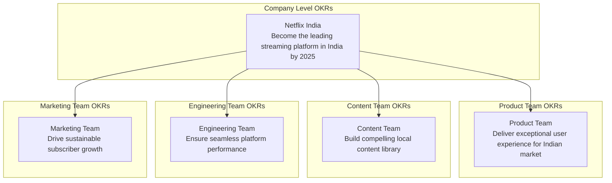
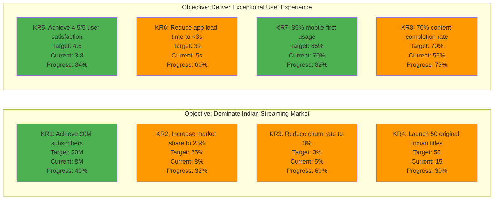
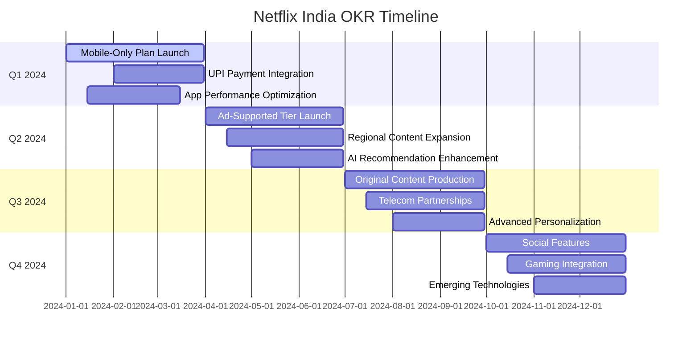
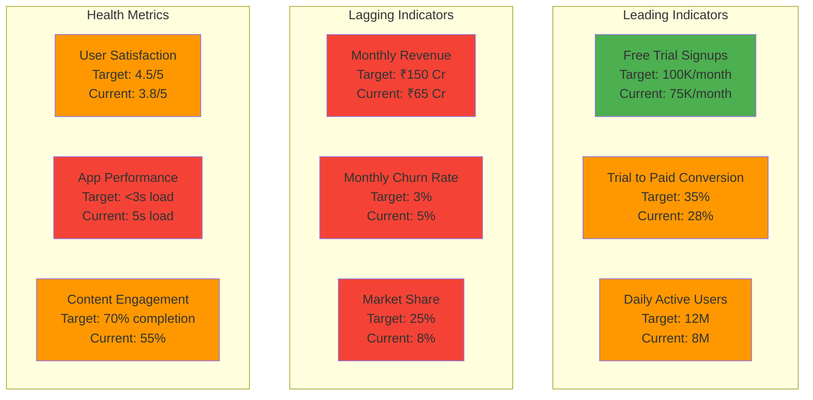

# OKR Framework Structure - Netflix India

## Detailed OKR Breakdown

## OKR Progress Tracking

## Success Metrics Dashboard

## OKR Review Process

### Weekly Check-ins:
- Progress updates on all KRs
- Identify blockers and dependencies
- Adjust tactics based on data

### Monthly Reviews:
- Detailed analysis of KR performance
- Cross-team collaboration assessment
- Resource allocation adjustments

### Quarterly Planning:
- Set new OKRs based on learnings
- Strategic alignment review
- Annual goal progress assessment
