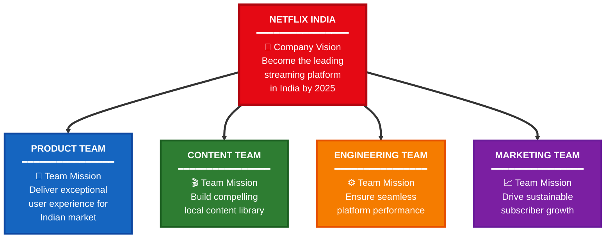
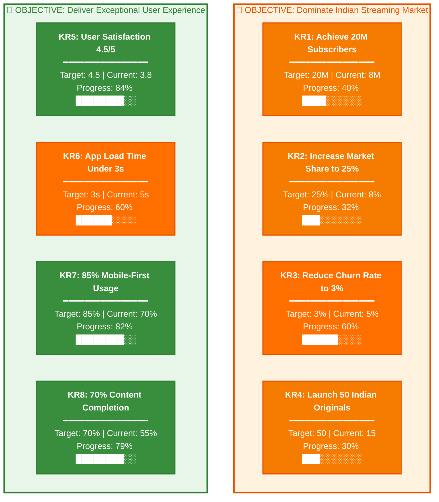
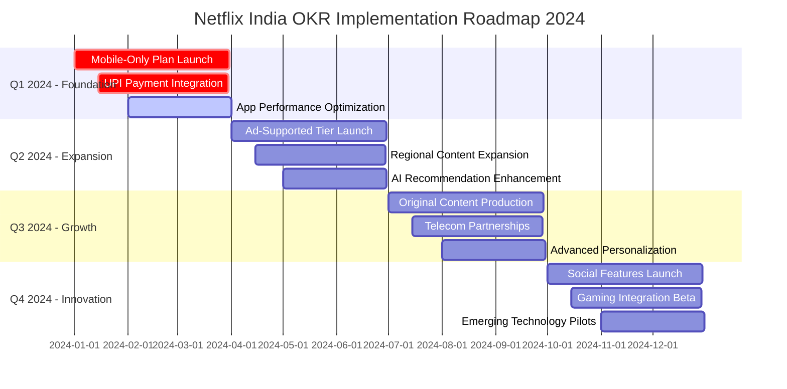
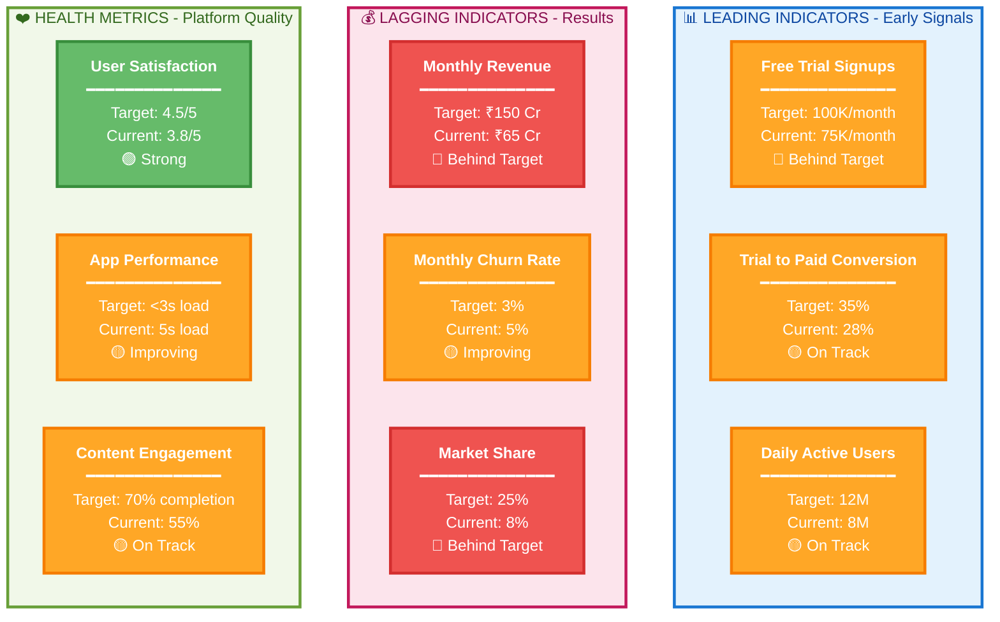
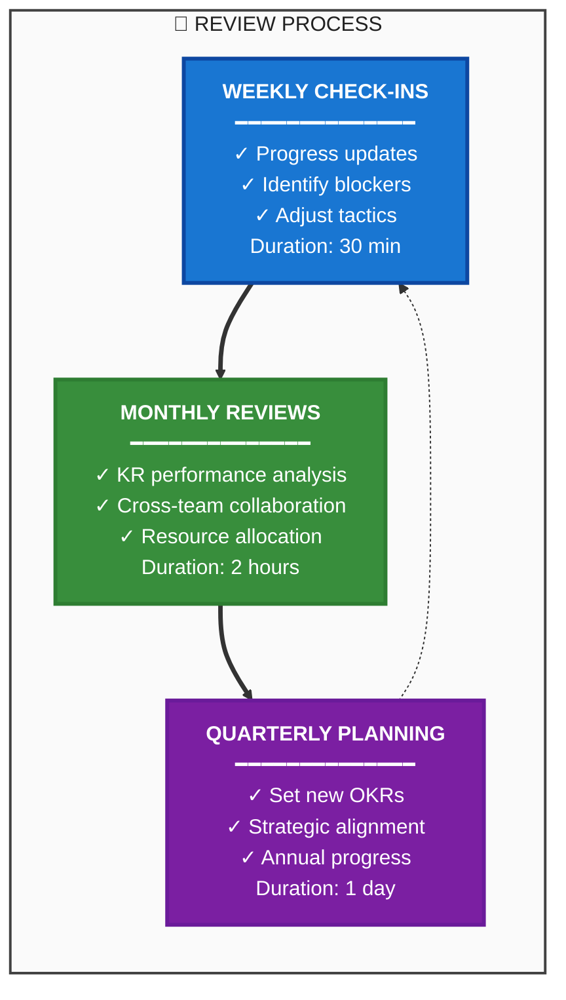

# 🎯 OKR Framework Structure - Netflix India

> **Strategic Goal-Setting Framework for Product Management Excellence**

---

## 🏢 Company and Team Alignment

### 📋 Organizational Structure Overview

<table>
<thead>
<tr>
<th width="20%">Team</th>
<th width="40%">Mission</th>
<th width="40%">Key Focus Areas</th>
</tr>
</thead>
<tbody>
<tr>
<td>🎨 <strong>Product</strong></td>
<td>Deliver exceptional user experience for Indian market</td>
<td>UX optimization, Feature development, User research</td>
</tr>
<tr>
<td>🎬 <strong>Content</strong></td>
<td>Build compelling local content library</td>
<td>Original productions, Regional content, Licensing</td>
</tr>
<tr>
<td>⚙️ <strong>Engineering</strong></td>
<td>Ensure seamless platform performance</td>
<td>App optimization, Infrastructure, Mobile-first</td>
</tr>
<tr>
<td>📈 <strong>Marketing</strong></td>
<td>Drive sustainable subscriber growth</td>
<td>Acquisition, Retention, Brand building</td>
</tr>
</tbody>
</table>

---

## 📊 Key Results with Progress Tracking

### 🎯 Objective 1: Dominate Indian Streaming Market

<table>
<thead>
<tr>
<th width="5%">KR</th>
<th width="35%">Key Result</th>
<th width="20%">Current → Target</th>
<th width="20%">Progress</th>
<th width="20%">Status</th>
</tr>
</thead>
<tbody>
<tr>
<td><strong>KR1</strong></td>
<td>📈 <strong>Achieve 20M Subscribers</strong></td>
<td><code>8M → 20M</code></td>
<td><strong>40%</strong> ████░░░░░░</td>
<td>🟡 On Track</td>
</tr>
<tr>
<td><strong>KR2</strong></td>
<td>🎯 <strong>Increase Market Share to 25%</strong></td>
<td><code>8% → 25%</code></td>
<td><strong>32%</strong> ███░░░░░░░</td>
<td>🔴 Behind</td>
</tr>
<tr>
<td><strong>KR3</strong></td>
<td>📉 <strong>Reduce Churn Rate to 3%</strong></td>
<td><code>5% → 3%</code></td>
<td><strong>60%</strong> ██████░░░░</td>
<td>🟢 Strong</td>
</tr>
<tr>
<td><strong>KR4</strong></td>
<td>🎬 <strong>Launch 50 Indian Originals</strong></td>
<td><code>15 → 50</code></td>
<td><strong>30%</strong> ███░░░░░░░</td>
<td>🔴 Behind</td>
</tr>
</tbody>
</table>

---

### 🎨 Objective 2: Deliver Exceptional User Experience

<table>
<thead>
<tr>
<th width="5%">KR</th>
<th width="35%">Key Result</th>
<th width="20%">Current → Target</th>
<th width="20%">Progress</th>
<th width="20%">Status</th>
</tr>
</thead>
<tbody>
<tr>
<td><strong>KR5</strong></td>
<td>⭐ <strong>User Satisfaction 4.5/5</strong></td>
<td><code>3.8 → 4.5</code></td>
<td><strong>84%</strong> ████████░░</td>
<td>🟢 Strong</td>
</tr>
<tr>
<td><strong>KR6</strong></td>
<td>⚡ <strong>App Load Time Under 3s</strong></td>
<td><code>5s → 3s</code></td>
<td><strong>60%</strong> ██████░░░░</td>
<td>🟢 Strong</td>
</tr>
<tr>
<td><strong>KR7</strong></td>
<td>📱 <strong>85% Mobile-First Usage</strong></td>
<td><code>70% → 85%</code></td>
<td><strong>82%</strong> ████████░░</td>
<td>🟢 Strong</td>
</tr>
<tr>
<td><strong>KR8</strong></td>
<td>🎯 <strong>70% Content Completion</strong></td>
<td><code>55% → 70%</code></td>
<td><strong>79%</strong> ████████░░</td>
<td>🟢 Strong</td>
</tr>
</tbody>
</table>

---

### 📊 Visual Progress Overview

---

## 📅 Implementation Timeline

### 🗓️ Quarterly Breakdown

<table>
<thead>
<tr>
<th width="15%">Quarter</th>
<th width="20%">Phase</th>
<th width="65%">Key Initiatives</th>
</tr>
</thead>
<tbody>
<tr>
<td>📅 <strong>Q1 2024</strong></td>
<td><strong>🏗️ Foundation</strong></td>
<td>
• 🔴 Mobile-Only Plan Launch 
• 🔴 UPI Payment Integration 
• 🟡 App Performance Optimization
</td>
</tr>
<tr>
<td>📅 <strong>Q2 2024</strong></td>
<td><strong>🚀 Expansion</strong></td>
<td>
• Ad-Supported Tier Launch 
• Regional Content Expansion 
• AI Recommendation Enhancement
</td>
</tr>
<tr>
<td>📅 <strong>Q3 2024</strong></td>
<td><strong>📈 Growth</strong></td>
<td>
• Original Content Production 
• Telecom Partnerships 
• Advanced Personalization
</td>
</tr>
<tr>
<td>📅 <strong>Q4 2024</strong></td>
<td><strong>💡 Innovation</strong></td>
<td>
• Social Features Launch 
• Gaming Integration Beta 
• Emerging Technology Pilots
</td>
</tr>
</tbody>
</table>

> 🔴 **Critical Path** | 🟡 **Active** | ⚪ **Planned**

---

## 📊 Success Metrics Dashboard

### 📈 Leading Indicators - Early Signals

<table>
<thead>
<tr>
<th width="25%">Metric</th>
<th width="20%">Target</th>
<th width="20%">Current</th>
<th width="15%">Gap</th>
<th width="20%">Status</th>
</tr>
</thead>
<tbody>
<tr>
<td>🎯 <strong>Free Trial Signups</strong></td>
<td><code>100K/month</code></td>
<td><code>75K/month</code></td>
<td>-25K</td>
<td>🔴 Behind Target</td>
</tr>
<tr>
<td>💰 <strong>Trial to Paid Conversion</strong></td>
<td><code>35%</code></td>
<td><code>28%</code></td>
<td>-7%</td>
<td>🟡 On Track</td>
</tr>
<tr>
<td>📱 <strong>Daily Active Users</strong></td>
<td><code>12M</code></td>
<td><code>8M</code></td>
<td>-4M</td>
<td>🟡 On Track</td>
</tr>
</tbody>
</table>

---

### 💰 Lagging Indicators - Results

<table>
<thead>
<tr>
<th width="25%">Metric</th>
<th width="20%">Target</th>
<th width="20%">Current</th>
<th width="15%">Gap</th>
<th width="20%">Status</th>
</tr>
</thead>
<tbody>
<tr>
<td>💵 <strong>Monthly Revenue</strong></td>
<td><code>₹150 Cr</code></td>
<td><code>₹65 Cr</code></td>
<td>-₹85 Cr</td>
<td>🔴 Behind Target</td>
</tr>
<tr>
<td>📉 <strong>Monthly Churn Rate</strong></td>
<td><code>3%</code></td>
<td><code>5%</code></td>
<td>-2%</td>
<td>🟡 Improving</td>
</tr>
<tr>
<td>📊 <strong>Market Share</strong></td>
<td><code>25%</code></td>
<td><code>8%</code></td>
<td>-17%</td>
<td>🔴 Behind Target</td>
</tr>
</tbody>
</table>

---

### ❤️ Health Metrics - Platform Quality

<table>
<thead>
<tr>
<th width="25%">Metric</th>
<th width="20%">Target</th>
<th width="20%">Current</th>
<th width="15%">Gap</th>
<th width="20%">Status</th>
</tr>
</thead>
<tbody>
<tr>
<td>⭐ <strong>User Satisfaction</strong></td>
<td><code>4.5/5</code></td>
<td><code>3.8/5</code></td>
<td>-0.7</td>
<td>🟢 Strong</td>
</tr>
<tr>
<td>⚡ <strong>App Performance</strong></td>
<td><code><3s load</code></td>
<td><code>5s load</code></td>
<td>-2s</td>
<td>🟡 Improving</td>
</tr>
<tr>
<td>🎯 <strong>Content Engagement</strong></td>
<td><code>70% completion</code></td>
<td><code>55%</code></td>
<td>-15%</td>
<td>🟡 On Track</td>
</tr>
</tbody>
</table>

---

### 📊 Visual Metrics Dashboard

---

## 🔄 OKR Review Cadence

### 📅 Review Schedule Details

<table>
<thead>
<tr>
<th width="20%">Cadence</th>
<th width="15%">Duration</th>
<th width="35%">Focus Areas</th>
<th width="30%">Participants</th>
</tr>
</thead>
<tbody>
<tr>
<td>🔵 <strong>Weekly Check-ins</strong></td>
<td><code>30 min</code></td>
<td>
• Progress updates 
• Identify blockers 
• Adjust tactics
</td>
<td>Team leads, Product managers</td>
</tr>
<tr>
<td>🟢 <strong>Monthly Reviews</strong></td>
<td><code>2 hours</code></td>
<td>
• KR performance analysis 
• Cross-team collaboration 
• Resource allocation
</td>
<td>All team members, Leadership</td>
</tr>
<tr>
<td>🟣 <strong>Quarterly Planning</strong></td>
<td><code>1 day</code></td>
<td>
• Set new OKRs 
• Strategic alignment 
• Annual progress review
</td>
<td>Full organization, Executives</td>
</tr>
</tbody>
</table>

---

## 📋 OKR Best Practices

<strong>💡 Click to see OKR implementation best practices</strong>

 

### ✅ Do's

<table>
<tr>
<td width="50%">

**🎯 Setting Objectives**
- Make objectives **inspirational** and **ambitious**
- Limit to **3-5 objectives** per team
- Align with company vision
- Focus on **outcomes**, not outputs

</td>
<td width="50%">

**📊 Defining Key Results**
- Make them **measurable** and **specific**
- Use **3-5 KRs** per objective
- Set **stretch goals** (60-70% achievement is good)
- Include leading and lagging indicators

</td>
</tr>
</table>

### ❌ Don'ts

<table>
<tr>
<td width="50%">

**🚫 Common Pitfalls**
- Don't create too many OKRs
- Don't make them too easy to achieve
- Don't confuse OKRs with tasks
- Don't set and forget

</td>
<td width="50%">

**⚠️ Avoid These Mistakes**
- Don't use OKRs for performance reviews
- Don't punish for missing stretch goals
- Don't work in silos
- Don't skip regular check-ins

</td>
</tr>
</table>

### 🔄 Review and Iteration

> **Key Principle:** OKRs are living documents. Review regularly, adjust as needed, and celebrate progress.

**Scoring Guidelines:**
- **0.0 - 0.3** 🔴 We failed - Need serious course correction
- **0.4 - 0.6** 🟡 Made progress - Good for stretch goals
- **0.7 - 1.0** 🟢 Achieved - Consider if goal was ambitious enough

---

## 🎨 Visual Improvements Made

<strong>📊 Click to see visual enhancement documentation</strong>

 

### ✅ Progress Visualization
- **Visual Progress Bars**: ASCII-style bars (████░░░░░░) for quick scanning
- **Status Indicators**: Color-coded by achievement level
  - 🟢 Green: 80-100% (On target)
  - 🟡 Orange: 50-79% (On track)
  - 🔴 Red: <50% (Behind target)
- **Emoji Icons**: Quick visual categorization (🎯 🎨 🎬 ⚙️ 📈)

### 🎨 Color System
- **Company Level**: Netflix red (#E50914) - brand alignment
- **Team Levels**: Distinct colors per function (blue, green, orange, purple)
- **KR Status**: Traffic light system (green/orange/red)
- **High Contrast**: All text white on dark backgrounds

### 📐 Layout Optimization
- **Gantt Chart**: Clear quarterly breakdown with color-coded priorities
- **Metric Cards**: Structured format with separators
- **Hierarchical Flow**: Top-down alignment with thick arrows
- **Subgraph Grouping**: Logical categories with descriptive headers

### 📝 Text Readability
- **Bold Headers**: Enhanced KR titles
- **Structured Data**: Target | Current | Progress format
- **Line Separators**: Visual breaks between sections
- **Multi-line Layout**: Prevents text cramping

### 🆕 Modern Enhancements
- **Tables**: Structured metric displays with icons
- **Badges**: Status indicators at top
- **Collapsible Sections**: Best practices and visual docs
- **Gap Analysis**: Current vs Target with delta calculation
- **Quarterly Breakdown**: Timeline in table format

---

## 📋 Educational Framework Disclaimer

<table>
<tr>
<td>

**👤 Author:** Vikas Sahani (vikassahani17@gmail.com)  
**🎯 Purpose:** Educational demonstration of OKR framework for product management  
**📚 Nature:** Hypothetical strategic framework for learning purposes only  
**🌐 Data Sources:** Standard OKR methodologies and publicly available best practices  
**✅ Compliance:** Educational content using industry-standard frameworks  
**⚠️ Disclaimer:** This framework does not represent actual Netflix OKRs or strategy

</td>
</tr>
</table>

---

**Made with 🎯 for OKR Excellence | 🎓 Educational Framework | 📊 Strategic Planning**

