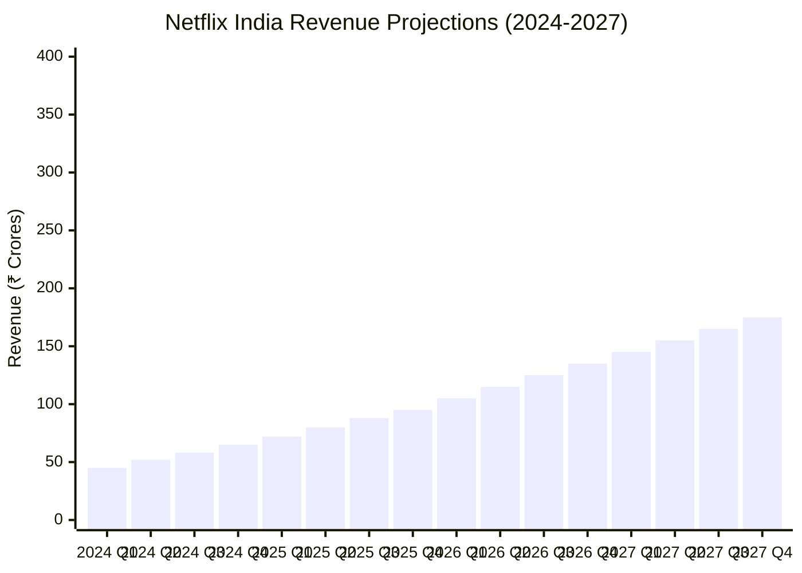
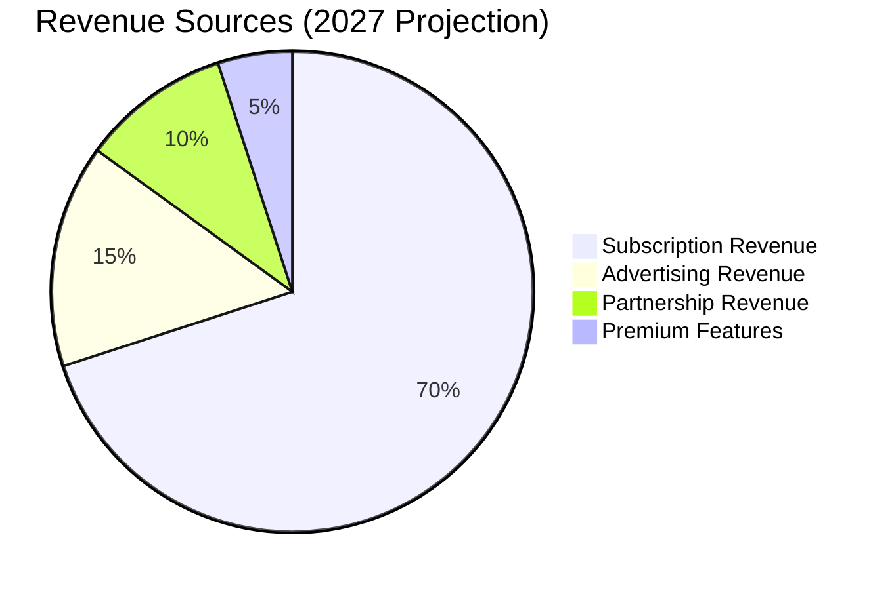
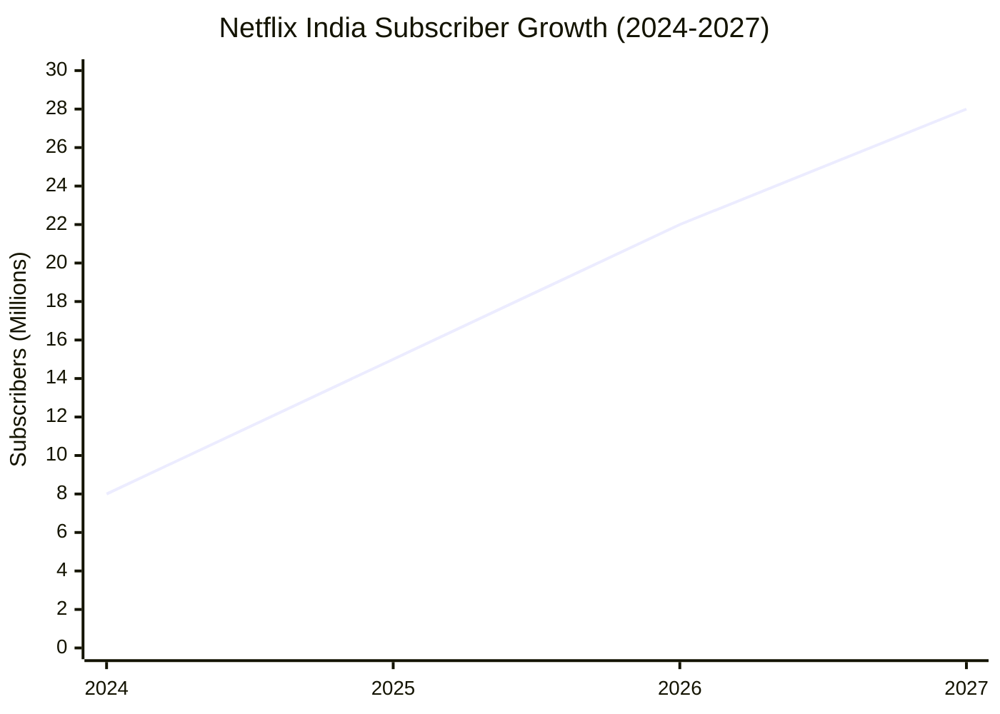
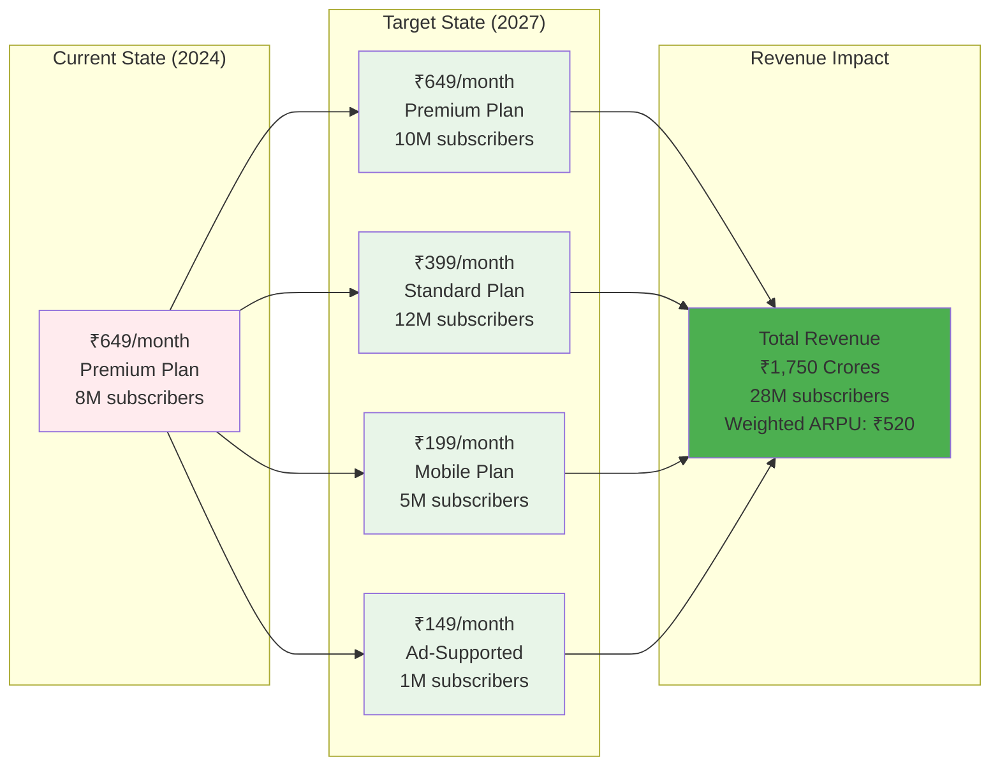
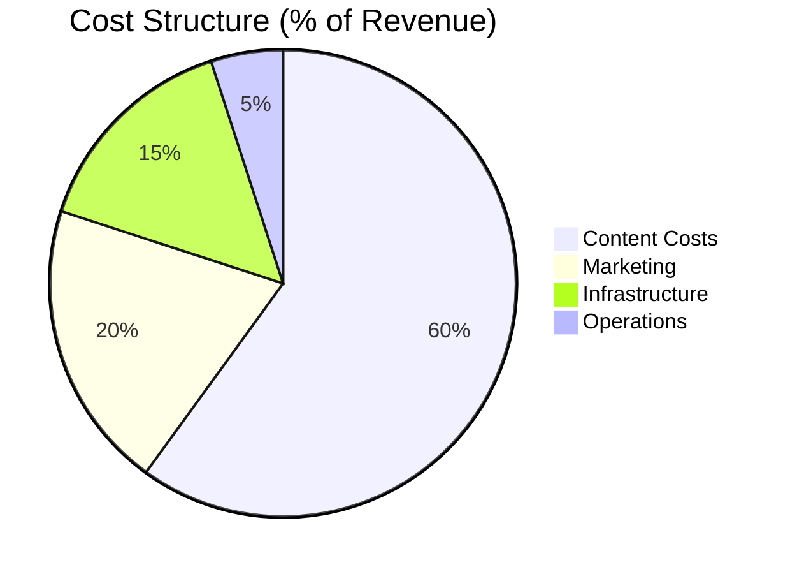

# 💰 Revenue Projection Model - Netflix India

### **Strategic Financial Projections & Revenue Modeling**

---

## 📈 Revenue Growth Trajectory

### 📊 Quarterly Revenue Analysis

<table>
<tr>
<th>Year</th>
<th>Q1</th>
<th>Q2</th>
<th>Q3</th>
<th>Q4</th>
<th>Annual Total</th>
<th>YoY Growth</th>
</tr>
<tr>
<td align="center"><strong>2024</strong></td>
<td align="right">₹45 Cr</td>
<td align="right">₹52 Cr</td>
<td align="right">₹58 Cr</td>
<td align="right">₹65 Cr</td>
<td align="right"><strong>₹220 Cr</strong></td>
<td align="center">-</td>
</tr>
<tr>
<td align="center"><strong>2025</strong></td>
<td align="right">₹72 Cr</td>
<td align="right">₹80 Cr</td>
<td align="right">₹88 Cr</td>
<td align="right">₹95 Cr</td>
<td align="right"><strong>₹335 Cr</strong></td>
<td align="center">📈 52.3%</td>
</tr>
<tr>
<td align="center"><strong>2026</strong></td>
<td align="right">₹105 Cr</td>
<td align="right">₹115 Cr</td>
<td align="right">₹125 Cr</td>
<td align="right">₹135 Cr</td>
<td align="right"><strong>₹480 Cr</strong></td>
<td align="center">📈 43.3%</td>
</tr>
<tr>
<td align="center"><strong>2027</strong></td>
<td align="right">₹145 Cr</td>
<td align="right">₹155 Cr</td>
<td align="right">₹165 Cr</td>
<td align="right">₹175 Cr</td>
<td align="right"><strong>₹640 Cr</strong></td>
<td align="center">📈 33.3%</td>
</tr>
</table>

---

## 💵 Revenue Mix Evolution

### 📋 Revenue Stream Breakdown

| Revenue Stream | 2024 | 2025 | 2026 | 2027 | CAGR |
|----------------|:----:|:----:|:----:|:----:|:----:|
| **Subscription Revenue** | ₹198 Cr (90%) | ₹268 Cr (80%) | ₹360 Cr (75%) | ₹448 Cr (70%) | 31.3% |
| **Advertising Revenue** | ₹0 Cr (0%) | ₹34 Cr (10%) | ₹72 Cr (15%) | ₹96 Cr (15%) | 95.0% |
| **Partnership Revenue** | ₹22 Cr (10%) | ₹33 Cr (10%) | ₹48 Cr (10%) | ₹64 Cr (10%) | 42.7% |
| **Premium Features** | ₹0 Cr (0%) | ₹0 Cr (0%) | ₹0 Cr (0%) | ₹32 Cr (5%) | N/A |
| **Total Revenue** | **₹220 Cr** | **₹335 Cr** | **₹480 Cr** | **₹640 Cr** | **42.8%** |

---

## 👥 Subscriber Growth Projection

### 📊 Subscriber Metrics Dashboard

<table>
<tr>
<th rowspan="2">Year</th>
<th colspan="4">Subscriber Base (Millions)</th>
<th rowspan="2">Total</th>
<th rowspan="2">Growth %</th>
</tr>
<tr>
<th>Premium</th>
<th>Standard</th>
<th>Mobile</th>
<th>Ad-Supported</th>
</tr>
<tr>
<td align="center"><strong>2024</strong></td>
<td align="center">5.0</td>
<td align="center">2.0</td>
<td align="center">1.0</td>
<td align="center">-</td>
<td align="center"><strong>8.0M</strong></td>
<td align="center">-</td>
</tr>
<tr>
<td align="center"><strong>2025</strong></td>
<td align="center">6.0</td>
<td align="center">5.0</td>
<td align="center">3.0</td>
<td align="center">1.0</td>
<td align="center"><strong>15.0M</strong></td>
<td align="center">📈 87.5%</td>
</tr>
<tr>
<td align="center"><strong>2026</strong></td>
<td align="center">8.0</td>
<td align="center">8.0</td>
<td align="center">4.0</td>
<td align="center">2.0</td>
<td align="center"><strong>22.0M</strong></td>
<td align="center">📈 46.7%</td>
</tr>
<tr>
<td align="center"><strong>2027</strong></td>
<td align="center">10.0</td>
<td align="center">12.0</td>
<td align="center">5.0</td>
<td align="center">1.0</td>
<td align="center"><strong>28.0M</strong></td>
<td align="center">📈 27.3%</td>
</tr>
</table>

---

## 💳 ARPU Evolution Strategy

### 💵 ARPU Analysis by Tier

| Plan Tier | Monthly Price | 2024 Subs | 2027 Subs | 2027 Revenue | % of Total |
|-----------|:------------:|:---------:|:---------:|:------------:|:----------:|
| **Premium** | ₹649 | 5.0M | 10.0M | ₹779 Cr | 44.5% |
| **Standard** | ₹399 | 2.0M | 12.0M | ₹575 Cr | 32.9% |
| **Mobile** | ₹199 | 1.0M | 5.0M | ₹119 Cr | 6.8% |
| **Ad-Supported** | ₹149 | - | 1.0M | ₹18 Cr | 1.0% |
| **Weighted ARPU** | - | **₹574** | **₹443** | - | - |

---

## 📊 Key Financial Metrics

### 🚀 Revenue Growth Drivers

<table>
<tr>
<th width="25%">Driver</th>
<th width="20%">Target</th>
<th width="55%">Strategy</th>
</tr>
<tr>
<td><strong>📈 Subscriber Growth</strong></td>
<td align="center">25% YoY</td>
<td>• Aggressive marketing campaigns • Regional content expansion • Telecom partnerships</td>
</tr>
<tr>
<td><strong>💰 ARPU Optimization</strong></td>
<td align="center">₹443</td>
<td>• Tiered pricing strategy • Premium feature upselling • Ad-supported tier introduction</td>
</tr>
<tr>
<td><strong>🔄 New Revenue Streams</strong></td>
<td align="center">30% of total</td>
<td>• Advertising platform launch • Brand partnerships • Gaming and interactive content</td>
</tr>
<tr>
<td><strong>📊 Market Penetration</strong></td>
<td align="center">20% share</td>
<td>• Mobile-first approach • Affordable pricing tiers • Local payment methods</td>
</tr>
</table>

---

## 💼 Cost Structure Analysis

### 📉 Operating Expense Breakdown

| Cost Category | 2024 | 2025 | 2026 | 2027 | Optimization Target |
|--------------|:----:|:----:|:----:|:----:|:------------------:|
| **Content Costs** | 65% | 62% | 60% | 60% | Economies of scale |
| **Marketing** | 25% | 22% | 20% | 20% | Organic growth increase |
| **Infrastructure** | 18% | 16% | 15% | 15% | CDN optimization |
| **Operations** | 7% | 6% | 5% | 5% | Process automation |
| **EBITDA Margin** | **-15%** | **-6%** | **0%** | **15%** | 🎯 **Target Achieved** |

---

## 📈 Profitability Timeline

### 🎯 Key Milestones

<table>
<tr>
<th>Milestone</th>
<th>Target Date</th>
<th>Status</th>
<th>Key Metrics</th>
</tr>
<tr>
<td><strong>🔄 Cash Flow Positive</strong></td>
<td>Q2 2025</td>
<td>🟡 On Track</td>
<td>Operating CF > 0</td>
</tr>
<tr>
<td><strong>💹 Break-even</strong></td>
<td>Q3 2025</td>
<td>🟡 On Track</td>
<td>Revenue = Costs</td>
</tr>
<tr>
<td><strong>✅ Positive EBITDA</strong></td>
<td>Q4 2025</td>
<td>🟡 Planned</td>
<td>EBITDA > 0</td>
</tr>
<tr>
<td><strong>🎯 Target Margin (15%)</strong></td>
<td>Q4 2027</td>
<td>🔵 Projected</td>
<td>EBITDA = 15%</td>
</tr>
</table>

---

## 🎯 Strategic Financial Goals

### 2027 Target Metrics

| Metric | Current (2024) | Target (2027) | Growth |
|:------:|:--------------:|:-------------:|:------:|
| **Annual Revenue** | ₹220 Cr | ₹640 Cr | 📈 191% |
| **Subscribers** | 8M | 28M | 📈 250% |
| **ARPU** | ₹229 | ₹190 | 📉 -17% |
| **EBITDA Margin** | -15% | 15% | ✅ +30pp |
| **Market Share** | 5% | 20% | 📈 4x |
| **Content Library** | 5,000 titles | 20,000 titles | 📈 4x |

---

## 📊 Sensitivity Analysis

### Impact of Key Variables on 2027 Revenue

| Variable | Base Case | -20% | -10% | +10% | +20% |
|----------|:---------:|:----:|:----:|:----:|:----:|
| **Subscriber Growth** | ₹640 Cr | ₹512 Cr | ₹576 Cr | ₹704 Cr | ₹768 Cr |
| **ARPU** | ₹640 Cr | ₹512 Cr | ₹576 Cr | ₹704 Cr | ₹768 Cr |
| **Ad Revenue %** | ₹640 Cr | ₹621 Cr | ₹631 Cr | ₹650 Cr | ₹659 Cr |
| **Churn Rate** | ₹640 Cr | ₹691 Cr | ₹665 Cr | ₹615 Cr | ₹589 Cr |

---

## 🚦 Risk Factors & Mitigation

| Risk | Impact | Probability | Mitigation Strategy |
|------|:------:|:-----------:|-------------------|
| **Competition Intensification** | 🔴 High | 🔴 High | Exclusive content, pricing flexibility |
| **Regulatory Changes** | 🔴 High | 🟡 Medium | Compliance team, local partnerships |
| **Economic Downturn** | 🟡 Medium | 🟡 Medium | Lower-tier plans, essential positioning |
| **Content Cost Inflation** | 🟡 Medium | 🔴 High | Original content, revenue sharing deals |
| **Technology Disruption** | 🟢 Low | 🟢 Low | Innovation labs, tech partnerships |

---

## 💡 Key Takeaways

> ### 🎯 Strategic Imperatives
> 
> 1. **📱 Mobile-First Monetization** - 70% of revenue from mobile-optimized tiers
> 2. **💰 Pricing Flexibility** - Multiple tiers to capture full market spectrum
> 3. **📺 Content Localization** - 60% local content to drive engagement
> 4. **🤝 Partnership Revenue** - Telecom and brand partnerships for 10% of revenue
> 5. **📊 Path to Profitability** - EBITDA positive by Q4 2025, 15% margin by 2027

---

### 📝 Model Documentation

| Property | Value |
|----------|-------|
| **Model Version** | 3.2.0 |
| **Last Updated** | 2025 |
| **Model Type** | Bottom-up Revenue Projection |
| **Confidence Level** | 75% |
| **Review Frequency** | Quarterly |
| **Next Review** | Q2 2025 |

---

**[⬆ Back to Top](#-revenue-projection-model---netflix-india)**

