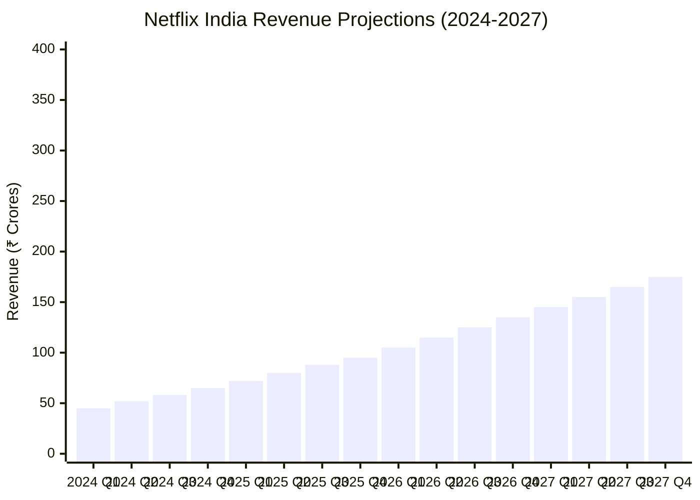
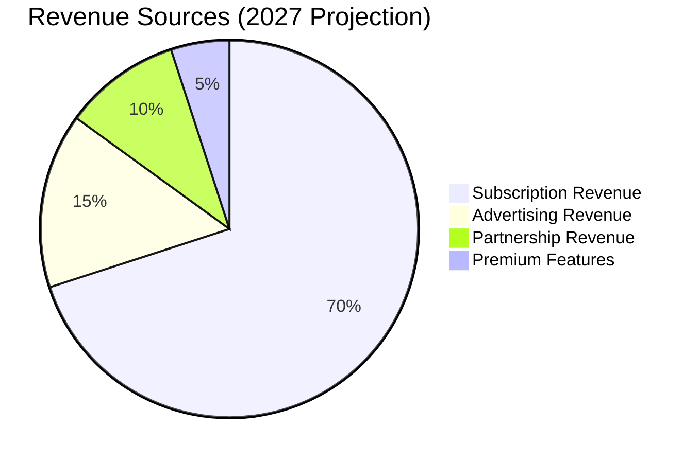
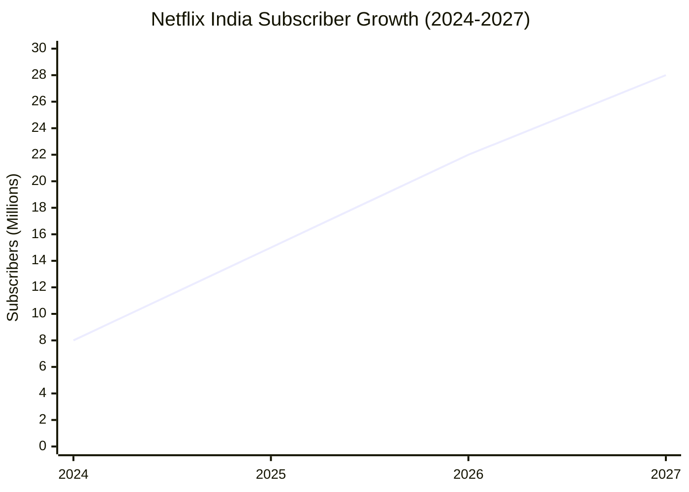
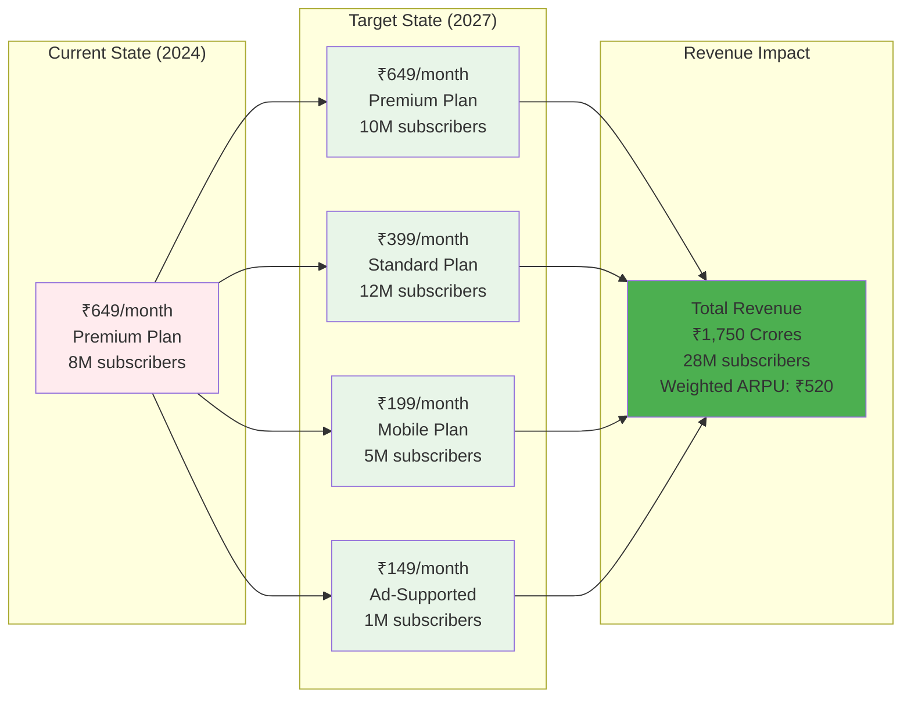

# Revenue Projection Model - Netflix India

## Revenue Breakdown by Source

## Subscriber Growth Projection

## ARPU Evolution

## Key Financial Metrics

### Revenue Growth Drivers:
1. **Subscriber Growth**: 25% YoY growth target
2. **ARPU Optimization**: Balanced pricing strategy
3. **New Revenue Streams**: Advertising and partnerships
4. **Market Penetration**: 20% market share by 2027

### Cost Structure:
- **Content Costs**: 60% of revenue
- **Infrastructure**: 15% of revenue
- **Marketing**: 20% of revenue
- **Operations**: 5% of revenue

### Profitability Timeline:
- **Break-even**: Q3 2025
- **Positive EBITDA**: Q4 2025
- **Target Margin**: 15% by 2027
