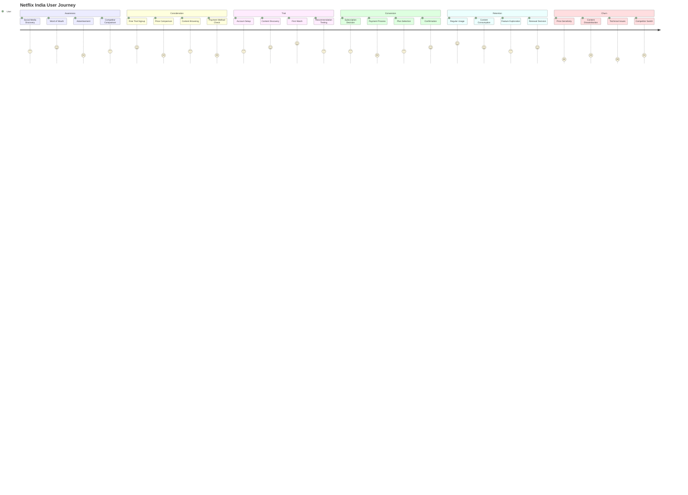

# User Journey Map - Netflix India Streaming Experience

## Pain Points Identified

### High Impact Pain Points:
- **Payment Process (2/5)**: Limited local payment methods
- **Price Comparison (2/5)**: High pricing relative to competitors
- **Technical Issues (1/5)**: Mobile app performance problems

### Medium Impact Pain Points:
- **Content Discovery (3/5)**: Poor recommendation for Indian content
- **Account Setup (3/5)**: Complex registration process
- **Feature Exploration (3/5)**: Limited mobile-first features

## Opportunity Areas

### Quick Wins:
1. **Payment Integration**: Add UPI, digital wallets
2. **Mobile Optimization**: Improve app performance
3. **Content Discovery**: Better regional content recommendations

### Strategic Initiatives:
1. **Pricing Strategy**: Mobile-only and ad-supported tiers
2. **Local Partnerships**: Telecom and device integrations
3. **Content Localization**: More regional language content
