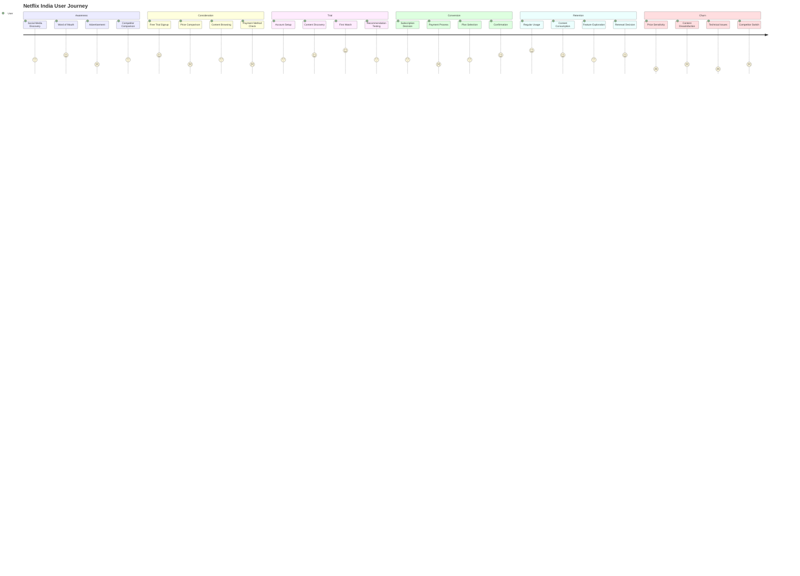
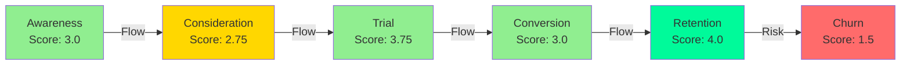

# 🎬 User Journey Map - Netflix India Streaming Experience

> **Document Purpose**: Analysis of user journey from awareness to churn for Netflix India market  
> **Last Updated**: October 2025  
> **Stakeholders**: Product, UX, Marketing Teams

---

## 📊 Journey Visualization

---

## 🚨 Pain Points Identified

### 🔴 High Impact Pain Points

<table>
<thead>
<tr>
<th>Pain Point</th>
<th>Score</th>
<th>Description</th>
<th>Impact</th>
</tr>
</thead>
<tbody>
<tr>
<td><strong>Payment Process</strong></td>
<td>2/5</td>
<td>Limited local payment methods</td>
<td>🔴 Critical</td>
</tr>
<tr>
<td><strong>Price Comparison</strong></td>
<td>2/5</td>
<td>High pricing relative to competitors</td>
<td>🔴 Critical</td>
</tr>
<tr>
<td><strong>Technical Issues</strong></td>
<td>1/5</td>
<td>Mobile app performance problems</td>
<td>🔴 Critical</td>
</tr>
</tbody>
</table>

### 🟡 Medium Impact Pain Points

<table>
<thead>
<tr>
<th>Pain Point</th>
<th>Score</th>
<th>Description</th>
<th>Impact</th>
</tr>
</thead>
<tbody>
<tr>
<td><strong>Content Discovery</strong></td>
<td>3/5</td>
<td>Poor recommendation for Indian content</td>
<td>🟡 Moderate</td>
</tr>
<tr>
<td><strong>Account Setup</strong></td>
<td>3/5</td>
<td>Complex registration process</td>
<td>🟡 Moderate</td>
</tr>
<tr>
<td><strong>Feature Exploration</strong></td>
<td>3/5</td>
<td>Limited mobile-first features</td>
<td>🟡 Moderate</td>
</tr>
</tbody>
</table>

---

## 💡 Opportunity Areas

### ⚡ Quick Wins

> **Timeline**: 0-3 months | **Effort**: Low-Medium | **Impact**: High

| # | Opportunity | Description | Expected Impact |
|---|-------------|-------------|-----------------|
| 1 | **Payment Integration** | Add UPI, digital wallets | 🟢 High conversion lift |
| 2 | **Mobile Optimization** | Improve app performance | 🟢 Reduced churn |
| 3 | **Content Discovery** | Better regional content recommendations | 🟢 Increased engagement |

### 🎯 Strategic Initiatives

> **Timeline**: 3-12 months | **Effort**: High | **Impact**: Transformative

<strong>1. Pricing Strategy</strong>

- Mobile-only and ad-supported tiers
- **Rationale**: Address price sensitivity in Indian market
- **Success Metrics**: Subscriber growth, ARPU optimization
- **Dependencies**: Ad platform integration, content licensing

<strong>2. Local Partnerships</strong>

- Telecom and device integrations
- **Rationale**: Reduce acquisition costs, increase accessibility
- **Success Metrics**: Partner channel conversions, bundled subscriptions
- **Dependencies**: Partner negotiations, technical integration

<strong>3. Content Localization</strong>

- More regional language content
- **Rationale**: Improve content-market fit
- **Success Metrics**: Watch time, content engagement rates
- **Dependencies**: Content acquisition, dubbing/subtitle infrastructure

---

## 📈 Journey Satisfaction Heatmap

---

## 📋 Action Items Checklist

### Immediate Actions (Week 1-4)
- [ ] Integrate UPI payment gateway
- [ ] Add Paytm, PhonePe wallet options
- [ ] Audit mobile app performance bottlenecks
- [ ] A/B test simplified onboarding flow

### Short-term Actions (Month 2-3)
- [ ] Deploy regional content recommendation engine
- [ ] Launch mobile-only pricing tier pilot
- [ ] Partner discussions with Jio, Airtel
- [ ] User research on feature discovery

### Long-term Actions (Quarter 2-4)
- [ ] Ad-supported tier development
- [ ] Content licensing for regional languages
- [ ] Device bundling partnerships
- [ ] Personalization algorithm enhancement

---

## 🔗 Related Documentation

- [Product Roadmap Q4 2025](#)
- [India Market Research Report](#)
- [Competitive Analysis: Hotstar vs Netflix](#)
- [Technical Performance Metrics Dashboard](#)

---

**Document Version**: 1.1 | **Maintained by**: Product Team | **Review Cycle**: Monthly

[Report Issue](#) • [Suggest Enhancement](#) • [View Analytics](#)

